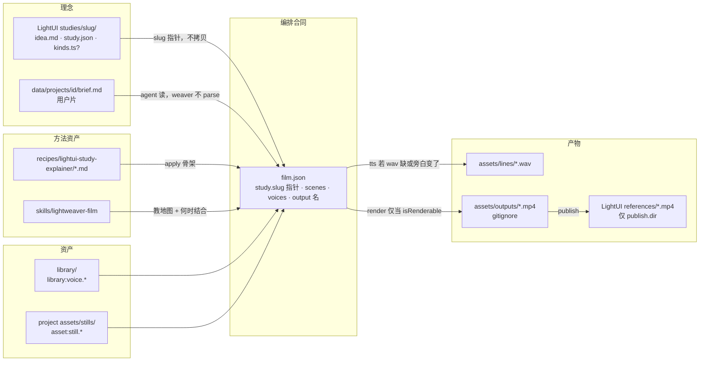
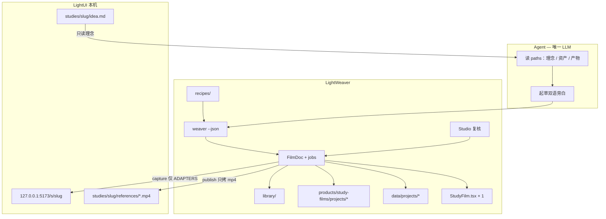
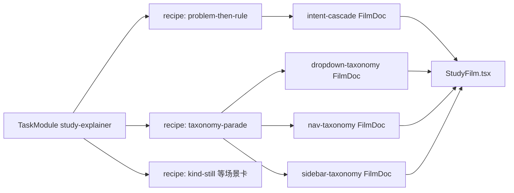
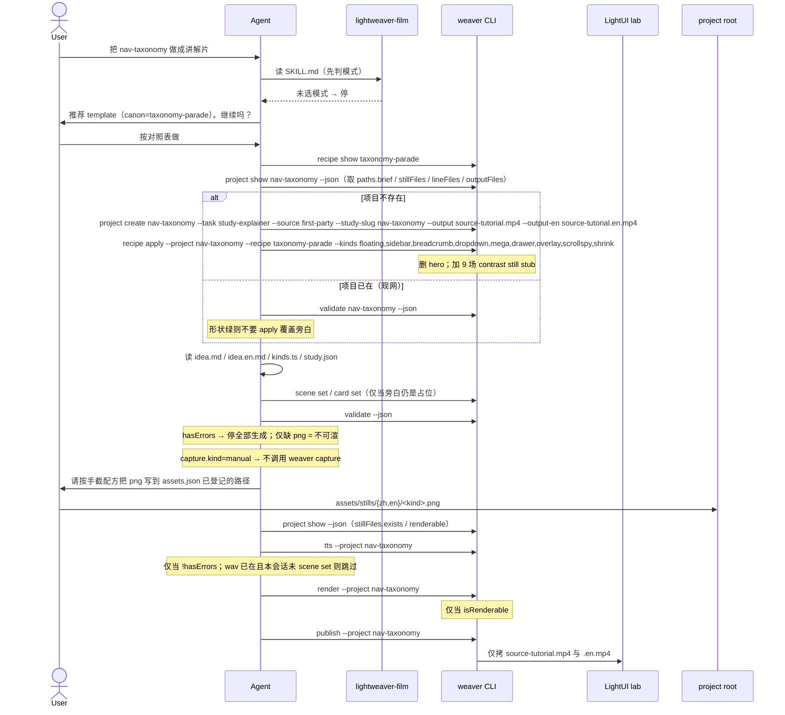
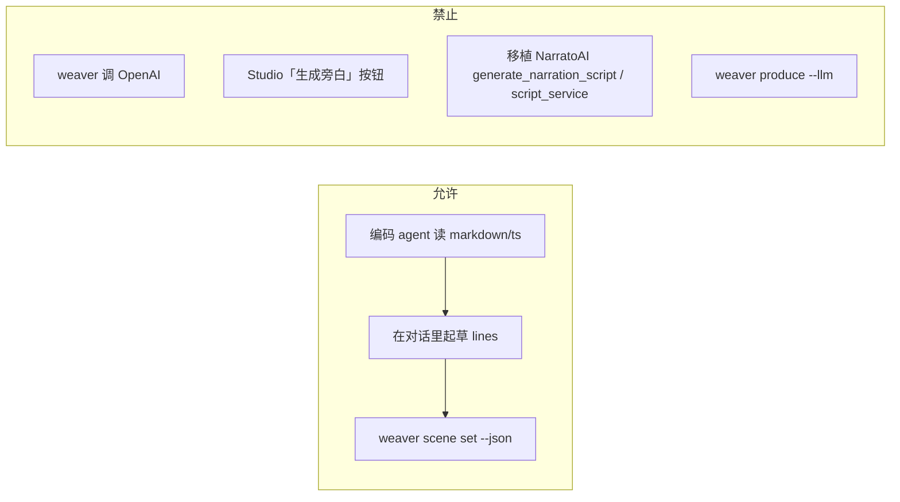

# LightWeaver 产品形态：理念 / 资产 / 产物 存放契约

| 字段 | 值 |
| --- | --- |
| 文档标题 | LightWeaver 产品形态设计：存放契约 + Agent 按图出片 |
| 作者 | LightWeaver maintainers |
| 日期 | 2026-08-15 |
| 状态 | Landed（PR1–PR5 已合；PR6 / Q-media = M2 不做） |
| 范围 | LightWeaver 工作区产品形状；坐在已落地的 study-explainer CRUD 之上 |
| 不实现 | MCP、Vercel、drama-plot 运行时、Remotion 逐片 codegen、CineWeaver 自动剪、NarratoAI 式 LLM 进核、空 recipe stub、DAM、LightTTS 训练面 |

> **与 `docs/design-study-explainer.md` 的关系：** 那份文档是任务核（TaskModule、FilmDoc、形状/媒体、CLI/HTTP、Studio CRUD）。本文不重开 D1–D13。本文把产品从「Studio 工作台 + 动词表」**重定位**为：一张固定的 **理念 / 资产 / 产物** 存放图，外加 agent 按图结合出片的循环。核保留，当 **agent 调用的确定性 job API**。

---

## Overview

LightWeaver 已经具备可跑的 study-explainer 闭环：`FilmDoc.task`、`weaver/src/tasks/`、场景 CRUD CLI / HTTP、`isRenderable`、Studio `StudyExplainerPane`、Remotion `StudyFilm`、四则 first-party 片子（intent / dropdown / nav / sidebar 均可渲）。对象其实已经分家——教学意图在 LightUI `studies/<slug>/idea.md`，共享音色在 `library/`，静帧与旁白 wav 在项目 `assets/`，成片应进 `assets/outputs/`（gitignore），发布拷贝才到 LightUI `references/`。但没有任何一张图把这三层钉死。Agent 只能在仓里乱走，或缩进 Studio CRUD；需要出片时不知道该读哪、写哪、复用哪、何时才该 `tts` / `render`。

本文把 LightWeaver 定成 **agent-driven 场景编排器，产品面首先是一张固定的存放地图**。Agent 读 **理念**，绑定 **资产**，在需要时经确定性 weaver job 写 **产物**。Recipe 是「怎么结合」的方法资产，不是产品本身。Remotion 渲染。Studio 检视。第一任务仍是 `study-explainer`；日后 `drama-plot` 换一套理念源 + recipe pack，仍走同一张三层图，不是成片自动剪。

**一句话产品定义：**

> LightWeaver 是 agent-driven 的场景编排器，产品面是一张固定的 **理念 / 资产 / 产物** 存放图。Agent 按路径找到理念、绑定资产、在需要时用确定性 weaver job 写出产物。Remotion 渲染。Studio 检视。

---

## Background & Motivation

### 对照产品实际做什么

| 系统 | 输入 | Agent 写什么 | 引擎做什么 | 与 LightWeaver |
| --- | --- | --- | --- | --- |
| **Remotion**（[Agent Skills](https://www.remotion.dev/docs/ai/skills)） | 一个创意 | **Remotion TSX**（`/remotion-create`、`/remotion-markup`） | 预览 / 渲染 | 我们用它的渲染器，不把「每片一份 composition」当作者语言 |
| **video-shotcraft**（[SKILL.md](https://github.com/Vincentwei1021/video-shotcraft/blob/main/SKILL.md)） | 产品页 / 截图 | 选 152 张镜头卡 + 写 Remotion 动效 | 2.5D 运镜 + SFX + 节拍 | 学它的 **skill 方法论 + 模式 + recipe 渐进披露**；不搬 Ink Press / 镜头动效 |
| **CineWeaver**（`products/cineweaver_desktop`） | **已有成片** | 几乎不写剧本；Desktop v1 是 ASR + OpenCV 对齐 + FFmpeg | `drama_clone/pipeline.py` → `cutter.py` **按时间线切已有素材** | 家族边界：不把自动剪折进本仓 |
| **NarratoAI**（`app/services/`） | 主题 + 已有视频 | Streamlit 活路径是 `webui/tools/generate_script_docu.py` → `generate_narration_script`，成片走 `task.start_subclip`。同族还有 `script_service.ScriptGenerator`（关键帧→剧本），**不是**当前 Streamlit 入口 | LLM 文案 → TTS → `clip_video` → 合成 | 流水线隐喻有用；架构（Python + LLM 进核 + 自动剪）不能抄。不要把 `script_service` 当成要移植的入口 |
| **LightWeaver 现网** | LightUI study | 人在 Studio 点，或 agent 对着动词表猜 | 确定性 CRUD + TTS + Remotion | 核已够用；缺的是 **一张可发现的存放图**，以及按图结合的 skill / recipe |

Remotion 文档称 MCP **弃用**、改走 Agent Skills（[docs/ai/mcp](https://www.remotion.dev/docs/ai/mcp)，2026 文档主张；本轮未再独立抓取核验）。本文不提议 LightWeaver MCP。

video-shotcraft 的产品形状值得对齐的部分：

1. **SKILL.md 先判模式**（模板 / 自主 / 共同创作），未定时停，不默默开工。
2. **SKILL.md 短**；`references/pipeline.md`、`references/shots/*.md` 按需再读。
3. **九条制作原则**是方法，不是 CLI 动词。
4. **阶段 0–7** 把贵操作（写 TSX / 全量采集）放在方向锁定之后。
5. **QA 是一等阶段**，不是「渲完再看」。

CineWeaver Desktop 实际做的是短剧复刻自动剪（`backend/services/drama_clone/pipeline.py` → `cutter.py` + OpenCV `visual_align.py`）；Streamlit 是另一条解说剪辑 WebUI。两者都吃**已有素材**。其 skill 里只有 `skills/cineweaver-workspace` 是工作区路由器；`cineweaver-product-backend` / `cineweaver-streamlit-ui` / `sync-third-party` 是产品编码指南，不是制作方法论。LightWeaver 现网三个 skill 同样偏路由 + 动词，缺存放图。`AGENTS.md` 写死：不把成片自动剪折进本仓。

### 现网（存放契约已落地）

| 层 | 路径 | 现状 |
| --- | --- | --- |
| 核 | `weaver/src/schema.ts` `FilmDoc.task` | `TASK_IDS = ["study-explainer"]`；`role`；`study.slug`。无 `SCENE_KINDS` 兼容别名 |
| 任务 | `weaver/src/tasks/{types,registry,study-explainer}.ts` | `createFilm` 种子 title+`hero`+close；校验 title/close 钉住 |
| 发现 | `weaver/src/project-paths.ts` | `project show --json` 同级 `paths` + `renderable`。静帧 `rel` 来自 `assets.json` |
| 方法 | `weaver/src/recipes.ts` + `recipes/lightui-study-explainer/` | 6 张真卡；`recipe list\|show\|apply`。apply 只铺 still、同 id 进 `skipped` |
| CLI | `weaver/src/cli.ts` | 上列动词 + `recipe`；写操作信封带 `paths` |
| 校验 | `weaver/src/validate.ts` | 形状 error / 媒体 warning；`isRenderable` 只看 still 场的 png |
| Studio | `products/studio/` | 复核面。CRUD 仍在；成片走 `/api/media`；详情带 `paths` |
| Remotion | `products/study-films/src/Root.tsx` + `compositions/StudyFilm.tsx` | **一部任务一个 composition**；片长读 wav，无 `timeline.ts` |
| Skills | `skills/lightweaver*` | 路由器 + 生产 skill（存放图 / 模式 / 结合规则）+ assets |
| 片子 | `data/first-party/`（gitignore） | LightUI 任务实例；不进 git。成片有 `publish.dir` 才拷到 LightUI `references/` |

当时痛点（无存放图、skill 只是动词表、Studio 当主入口）已由本文 PR1–PR5 关闭。仍开放的只有 Q-media = M2：nav / sidebar 手截出片不在本仓实现范围。

### 第一顾客没有变

仍是 LightUI `studies/`。四则：

| slug | 结构（已在 FilmDoc） | 媒体 |
| --- | --- | --- |
| `intent-cascade` | title → problem → diagonal → vertical → third → close | png + wav，可渲；output = `cursor-movement.mp4` |
| `dropdown-taxonomy` | title + 7 kind + close | 同上；`source-tutorial.mp4` |
| `nav-taxonomy` | title + 9 kind + close | png + wav，可渲；`source-tutorial.mp4` |
| `sidebar-taxonomy` | title + 5 kind + close | 同上 |

`idea.md` 的三问（缺了什么会坏、规则是什么、朴素替代为什么更差）和「名称 / 场景 / 规则」是 **理念**，住在 LightUI study 里。Agent 写旁白前必须按路径去读。**不要**把 `idea.md` 拷进 LightWeaver 片子目录。`film.study.slug` 已经是指针。

---

## Goals & Non-Goals

### Goals

1. **存放位置一等。** 理念 / 资产 / 产物 各有唯一路径与引用方案。Agent 按图找到对象，结合已有资产，**只在需要时**生成视频；不在仓里游荡，不把 Studio CRUD 当地图。
2. **Agent 按图出片。** 主路径是：读理念 → 选 recipe（怎么结合）→ 绑资产 → 写旁白 → 调 weaver。Studio 降为复核。
3. **Skill 教地图 + 何时结合。** 一条生产 skill：存放图 + 三种模式 + 何时停 / 何时复用 / 何时跑 weaver。路由器保持薄。
4. **Recipe 是方法资产。** 从四则已有片子抽出 **6 张真实卡**（不是 152 张空卡），放在仓库根 `recipes/lightui-study-explainer/`，教 agent 怎么把理念和资产合成 FilmDoc。
5. **确定性核不动。** 已有 CRUD / `isRenderable` / TaskModule 循环禁令全部保留。LLM 不准进 `weaver/` 或 Studio job。
6. **最小 CLI 增量** 让发现可靠：PR1 `project show --json` 带 `paths`；**PR2** `recipe list|show`；**PR3** `recipe apply`。不加 `produce`，不加核内规划器。
7. **QA 是 skill 一等阶段。** `!isRenderable` 禁止 render。双语、title/close 钉、SOURCE.md、role 都进清单。
8. **日后 `drama-plot` 走同一张三层图**（另一 TaskModule + 另一理念源 + 另一 recipe pack），而不滑向 CineWeaver。

### Non-Goals（收锐）

- 不把 LightWeaver 做成 Remotion skill pack（agent 不为每部片子写 `StudyFilm` 以外的 TSX）。
- 不把 LightWeaver 做成 video-shotcraft（无 Ink Press、无 2.5D、无 152 镜头卡、无 SFX/BGM 钉帧）。
- 不把 LightWeaver 做成 CineWeaver / NarratoAI（不摄入已有成片、不 ASR、不自动切、不 Streamlit）。
- 不把 LightWeaver 做成通用 NLE 或 Studio-first CRUD 应用（CRUD 可留，产品故事不许再是「打开工作台改 JSON」）。
- 不做 MCP、不部署 Vercel、不绑非 `127.0.0.1`。
- 不实现 `drama-plot` 运行时、空 `explore/`、空 composition、空 recipe stub。
- 不把 `library/` 做成 DAM；不调 LightTTS 训练面；引擎不搬回 LightUI。
- LightUI **公开 README / lab** 不出现兄弟私有仓名。
- weaver 不 import `products/*`；Studio 不 import Remotion 或 LightUI 源码。
- 本文 **不** 把 nav/sidebar 的手截 png + TTS + 发布当成必须落地的实现范围（**Q-media 已拍板：M2**）。

---

## Key Decisions

相对 `docs/design-study-explainer.md` 的 D1–D13，下列是**产品形状**决策。D1–D13 全部继承，不重开。

### P0 · 产品一等对象是「理念 / 资产 / 产物」三层存放契约

**选定：** LightWeaver 的产品面首先是一张 **固定存放图**。Agent 按路径读理念、绑资产、写产物。Studio 不是地图。152 张镜头卡不是产品。Recipe 是 **怎么结合** 的方法资产，挂在 `recipes/`，服务这张图。

| 层 | 住哪 | 不往哪写 |
| --- | --- | --- |
| 理念 | 跟主题走：first-party → LightUI `studies/<slug>/`；用户片 → `data/projects/<id>/brief.md` | 不把 `idea.md` 拷进片子目录；不把产物写进理念目录 |
| 资产 | `library/`（共享）+ 项目 `assets/` + `assets.json` | `library/` 不是 DAM；不把 stills 写进 LightUI `references/` |
| 产物 | 中间件 `assets/lines/`；成片 `assets/outputs/`（gitignore）；有 `publish.dir` 才拷 mp4 | 不提交 outputs；不把 wav/mp4 写进 LightUI study 源码树以外的地方 |

**理由：** 用户拍板「主要是资产、产物、理念等存放位置明确，让 agent 在需要的时候能够结合生成视频」。对象已经分家，缺的是契约与发现面。

### P1 · 循环仍是 agent-driven 场景编排（形状对齐 Remotion / shotcraft）

**选定文案：** 在 P0 的图上，LightWeaver 仍是 **agent-driven 场景编排器**。Agent 按 skill 教的方法论填 `FilmDoc`，weaver 跑确定性 job，Remotion 渲成片，Studio 复核。

**不是：** Remotion 本身、shotcraft 动效工作室、CineWeaver 自动剪、NarratoAI 短视频工厂、Studio-first JSON 工作台。

**理由：** 用户点名 Remotion / shotcraft 的是 **agent 驱动那种产品形状**，不是它们的视觉域。驱动方式服务于存放图：按路径结合，而不是在 CRUD 里点。

### P2 · Remotion 是渲染器，不是每片的作者语言

`products/study-films/src/compositions/StudyFilm.tsx` 继续是 **一个任务一个 composition**。`Root.tsx` 靠 `weaver sync` 的 catalog 挂实例。Agent **v1 禁止**为某部片子生成新 TSX。

**理由：** Remotion skill（`/remotion-create`、`/remotion-markup`）面向「从零写动画」。我们的画面语言已经冻结为 title 卡 + still + close 卡。把作者面放到 TSX，等于抛弃 FilmDoc，并诱使每片一份 composition。

### P3 · Studio 是控制站：人管音色和素材，agent 出片

不删 Studio（`products/studio/`，`127.0.0.1:5175`）。它是带路线的本机站，不是单页工作台：

- 人监管 `/voices`、`/library`
- 人在 `/f/<id>` 点名 `film.voices` 与 `film.kit`（告知 agent 用哪支声、哪些元素）
- agent 经 weaver 写场、配音、渲染
- 站里回放 mp4、看校验。**不加** TTS/渲染按钮、Remotion Player、lab iframe、站内 LLM、「一键写旁白」

CRUD API 仍在，给点名和入库用。产品文案第一路径仍是 agent 出片。

### P4 · Agent 面是 Skill，不是 MCP，不是「Studio 当 API」

对齐 Remotion 弃用 MCP 的理由。三个 skill 重切：

| Skill | 角色 |
| --- | --- |
| `skills/lightweaver` | **薄路由器**（现网已是；只补「制作一部片子 → film」） |
| `skills/lightweaver-film` | **生产 skill**：模式 + 原则 + 阶段 + 何时停。动词表缩短并指向 CLI |
| `skills/lightweaver-assets` | **保留**。见 P8 |

不发明 MCP tools。HTTP 仍是 Studio 自己的本地 API，不是 agent 主面。

### P5 · Recipe 是方法资产：教怎么结合，不是产品本身

Recipe 编码「如何把理念 + 资产写成 FilmDoc」。Template 是填好的起点。Composition 是渲染器。四层必须分清（见下文）。Agent 选 recipe，不选「新 kind」、不选「新 TSX」。

**存放（关闭原 Q-recipe-root）：** 仓库根 `recipes/lightui-study-explainer/`。与 `library/`（媒体资产）、`docs/` 平级，是产品对象。禁止 `library/recipes/`（会把 library 混成 DAM）。禁止 `skills/lightweaver-film/recipes/`（skill 附件不是存放面）。Skill `references/` 只留方法论（pipeline / modes / qa）。

### P6 · LLM 只住在 agent 进程里

`weaver/` 保持纯函数 + 文件 + 子进程（`scripts/tts.py`、Remotion CLI、`capture.mjs`）。旁白起草：agent 读 `idea.md` / `idea.en.md` / `study.json` / `kinds.ts`，再 `weaver scene set` / `card set`。

禁止后续：「Studio 加 ChatGPT」、「NarratoAI `app/services/script_service.py` 移植进 weaver」、「`weaver produce` 内部调模型」。

### P7 · 最小新 CLI：PR1 给 `paths`；PR2 `recipe list|show`；PR3 `apply`。没有 `produce`

现有动词已经能无手改 JSON 出片。缺的是 **存放发现**（PR1：`project show` 的 `paths`）、**配方发现**（PR2）与 **骨架展开不发明 kind**（PR3 `apply`）。

```
npx weaver recipe list [--task study-explainer]
npx weaver recipe show <id>
npx weaver recipe apply --project <id> --recipe <id> [--kinds a,b,c]
```

`list` / `show` **PR2** 落地；`apply` **PR3** 落地。PR1–PR2 展开骨架只用现有 `scene add`，对照 first-party `film.json` 或（PR2 起）recipe 正文。

`apply` **不写旁白、不猜 output 文件名、不跑 TTS/渲染、不读 `kinds.ts`**。需要 kind 列表时由 agent 传入。没有 LLM。

不加 `weaver produce` / `weaver plan`：那两个名字会变成「核内编剧」。

### P8 · 资产 skill 独立，不折进生产 skill

**保留** `skills/lightweaver-assets`。

**理由：** `library/` 是共享 **资产** 层（`weaver/src/paths.ts` `libraryRoot`），与一部片子的制作循环生命周期不同。生产 skill 必须短，且必须把「资产入库」和「理念阅读 / 产物生成」分开教。折进去会把方法论淹没在 DAM 动词里，并诱使 `library/` 膨胀。

### P9 · 三种模式，用 LightWeaver 自己的名字

对照 shotcraft 的模板 / 自主 / 共同创作，**不**沿用 Ink Press 商标：

| 模式 id | 何时 | 停哪里 |
| --- | --- | --- |
| `template` | 用户点名「按 dropdown / intent 那套」或 recipe 的 canon 片 | 只在静帧缺失且无 adapter 时停 |
| `from-study` | 用户给了 LightUI slug，授权连续做完 | 缺 study 源、缺 recipe 匹配、`!isRenderable` 要渲染时停 |
| `co-create` | 用户要一起定结构 / 旁白 | 模式确认、recipe、脚本稿、静帧齐备 四处停 |

未选模式 → **停**。例外：用户已点名 recipe id 或「按 taxonomy-parade 做 nav」视为 `template` 已选。

### P10 · 制作阶段 0–7（shotcraft 同构，语义换成讲解片）

见 Proposed Design。阶段 5 在 shotcraft 是「写 Remotion TSX」；在我们这里是 **TTS**。画面实现已经冻结在 `StudyFilm`。

### P11 · v1 只提交 6 张从四则 study 抽出的真卡

禁止 152 张空卡、禁止「以后再用」的 stub 文件。没有第五则 study 就不要预写第七张卡。

### P12 · 前一份设计全部有效

TaskModule 禁 import `project.ts` / `validate.ts` / `assets.ts`；`film.id === study.slug ===` 目录名；一种 kind 一场；无 `publish.dir` 只本地渲；种子带 `hero`、first-party 入库前删掉——全部不改。

### P13 · 家族边界不因「agent 产品」松动

| 仓 | 继续只做 |
| --- | --- |
| LightWeaver | 先写场景再配仍不存在或新截的静帧，合成讲解片 |
| CineWeaver | 已有成片 / 短剧 **自动剪** |
| LightTTS | TTS 模型；本仓只调 `scripts/tts.py` |
| LightAsset | 通用 DAM |
| LightUI | 顾客；capture HTTP lab；publish 只拷 mp4 |

`drama-plot` 若落地：仍 script-first 场次编排，**输入不是已有成片**。

### P14 · 发现面：媒体用 `MediaFile` / `MediaPath`，理念用 brief `PathEntry`；v1 旁白新旧只看「本会话是否 scene set」

`paths` 上媒体是数组 / locale 映射，**不是** `lineFiles[locale][sceneId]` 嵌套表。由 `film.locales` + `film.scenes` + `assets.json` + `existsSync` 拼出来，不扫仓库。Agent 用这些字段决定复用 / 生成 / 停止。

查找旁白文件：

```ts
lineFiles.find((f) => f.locale === locale && f.sceneId === id)
```

静帧同理：`stillFiles.find((f) => f.locale === locale && f.sceneId === id)`。成片：`outputFiles[locale]`。

`MediaFile` 与 `outputFiles` 的值 **必须带 `rel`**（项目相对路径，给 `/api/media`）。`brief.files` 在项目外，只有 `{ path, exists }`，`rel` 可选且 v1 不填。

**v1 旁白是否过期（不改 FilmDoc）：**

- `lineFiles.find(f => f.locale === locale && f.sceneId === id)?.exists !== true` → `tts --project --scene <id>`（或整片 tts）。
- 该条 `exists === true` → **复用**，除非**本会话刚刚**对该 scene 做过 `scene set --text`（agent 自己记账；weaver / line asset **不**写文本哈希）。

禁止 v1 给 line asset 加 `textHash`（YAGNI，避免 FilmDoc / `assets.json` 迁移）。`runTts` 现网仍会整片重合成；skill 的结合规则约束 **agent 何时调用**，不改 `runTts` 签名。

---

## Proposed Design

### 存放地图 / Placement Contract

这是产品面。Agent 出片前先按这张图找齐三层；skill 的第一课就是这张图，不是动词表。路径函数见 `weaver/src/paths.ts`：`weaverRoot`、`libraryRoot`、`firstPartyRoot`、`userRoot`、`filmsProductRoot`、`lightuiRoot`、`labUrl`。

#### 三层分流

| 层 | 跟谁走 | 现网锚点 | 禁止 |
| --- | --- | --- | --- |
| **理念** | 跟 **主题** 走，不跟渲染器走 | first-party：LightUI `studies/<slug>/idea.md` + `idea.en.md` + `study.json` + `references/SOURCE.md`。**taxonomy 片另有** `src/lib/kinds.ts`（nav / sidebar / dropdown）；**`intent-cascade` 无 kinds.ts**。片子只存指针 `film.study.slug`（`schema.ts` `filmStudySlug`，缺省回退 `capture.slug`） | **不**把 `idea.md` 拷进 LightWeaver 片子目录（双源）。**不**在 weaver 里 parse 理念 markdown |
| **理念（用户片）** | 跟 **项目** 走（没有 LightUI study） | `data/projects/<id>/brief.md` + 可选 `brief.en.md`。Agent 写；`createProject` 不代写正文 | weaver **不**解析 brief（YAGNI）。没有 brief 时 skill 先写 brief 再写旁白 |
| **资产** | 共享 vs 片内 | `library/` = 音色 / 元素 / 参考（现网 `library/assets.json`：`voice.prompt` 一套绑中英、`element.mark`）。片内：`assets.json` + `assets/stills/<locale>/`。引用只许 `library:` / `asset:`（`schema.ts` `parseAssetRef`） | `library/` 不是 DAM。不把 stills 写进 LightUI `references/`。不发明第三套 ref scheme |
| **产物** | 跟 **项目** 走，发布才离开 | 中间件：`assets/lines/<locale>/<scene>.wav`（`assets.ts` `lineRelPath`）。成片：`assets/outputs/<output>`（`outputRelPath`，根 `.gitignore` 已有 `**/assets/outputs/`）。有 `publish.dir` 才拷到 LightUI `studies/<slug>/references/`（**只 mp4**） | 不提交 outputs。不把 wav/mp4 写进理念目录。`products/study-films/src/generated/catalog.json` 是 Remotion 胶水，**不是**用户产物 |

`film.json` 是 **编排合同**（场景序、旁白、引用、output 名），横跨三层，但本身既不是理念源、也不是媒体文件。Agent 经 CLI 写它，不手改当日常路径。

日后 `drama-plot`：理念换成场次 / 节拍源（仍跟主题走，不进 `library/`），资产与产物路径不变。现在不建空目录。

#### 对象表（现网每一种活对象）

| 中文层 | English | 规范路径 | 谁写 | 谁读 | Git | 引用 |
| --- | --- | --- | --- | --- | --- | --- |
| 理念 · study 意图 | teaching brief | `{LIGHTUI_ROOT}/studies/<slug>/idea.md`、`idea.en.md` | LightUI 作者 | Agent（写旁白前） | 在 LightUI 仓 | 文件系统；片子用 `study.slug` 指向 |
| 理念 · study 机器元数据 | study contract | `…/studies/<slug>/study.json` | LightUI | Agent；`createFilm` **软读** title/summary（`study-explainer.ts` `readStudyCards`，LightUI 不在则跳过） | LightUI | 文件系统 |
| 理念 · 模型清单 | kind list | **仅 taxonomy：** `…/studies/<slug>/src/lib/kinds.ts`（dropdown / nav / sidebar）。intent-cascade **没有** 此文件 | LightUI | Agent 读 `KindId` / `oneLiner` 再传入 `--kinds`。`problem-then-rule` 只读 `idea.md` + `study.json`。weaver **不** parse TS | LightUI | 文件系统；`paths.brief.files.kinds.exists` 可为 false |
| 理念 · 成片文件名 | publish name | `…/studies/<slug>/references/SOURCE.md` | LightUI | Agent；`studyExplainer.validate` 若文件在则 warning 未点名 | LightUI | 文件系统（正文须含 `locales.*.output`） |
| 理念 · 用户片 brief | project brief | `data/projects/<id>/brief.md`、可选 `brief.en.md` | Agent | Agent。weaver 不读 | `data/projects/` 整树 gitignore（`.gitignore`） | 文件系统 |
| 编排合同 | FilmDoc | first-party：`products/study-films/projects/<id>/film.json`；user：`data/projects/<id>/film.json`（`firstPartyRoot` / `userRoot`） | Agent via CLI / Studio PATCH | weaver、Remotion `Root.tsx`、Studio | first-party 提交；user 不提交 | 无 ref；`film.id ===` 目录名 |
| 方法资产 | recipe | `recipes/lightui-study-explainer/<id>.md` + `index.md` | 维护者 | Agent：`weaver recipe list\|show\|apply` | 已提交 | 文件系统；`recipeRoot() = join(weaverRoot(), "recipes")` |
| 共享资产登记 | library catalog | `library/assets.json` | `weaver asset add --library` | `findAsset` / `loadLibrary` | 提交 | `library:<id>` |
| 共享音色 | voice | 克隆源二选一：上传录音，或 instruct 铸完再收。铸/听/留在 Studio `/voices` | 人 | 出片 `runTts` 固定 Hi-Fi clone（`ref_audio` + `ref_text`） | 提交 wav | `library:voice.prompt` |
| 共享元素 | element | `library/elements/mark.svg` | 人 | Remotion `Mark.tsx` | 提交 | `library:element.mark` |
| 片内资产登记 | project catalog | `<project>/assets.json` | `asset add` / `ensureStillStub` / tts upsert | `resolveAssetFile` | first-party 提交 stub | `asset:<id>` |
| 片内静帧 | still | 引用 **id** = `asset:still.<id>`。**盘上文件名以 `assets.json` `files.<locale>` 为准**，不是从 id 推导。`stillRelPath(name, locale)` = `assets/stills/<locale>/<name>`，**不**自动加 `.png`。新 taxonomy / manual 约定 `<kind>.png`（`docs/conventions.md`）。历史名保留：intent `desktop-full.png` 等；dropdown `comp-02.png` / `select-open.png` / `date-cal.png` | `capture.mjs`（仅 ADAPTERS）或手截 / 上传 | Remotion `staticFile`；`isRenderable` 看每个 locale 文件是否存在 | first-party 完成片提交 png；骨架可不提交 | `asset:still.<id>` |
| 产物 · 旁白 | line wav | `<project>/assets/lines/<locale>/<scene>.wav`（`lineRelPath`） | `weaver tts` | Remotion 时长；validate warning 若缺 | 现网完成片 **提交** wav（intent / dropdown 惯例） | `asset:line.<scene>.<locale>` |
| 产物 · 成片 | output mp4 | `<project>/assets/outputs/<output>`（`outputRelPath`） | `weaver render` | Studio `<video>`；`runPublish` 源 | **不提交**（`**/assets/outputs/`） | 文件系统；`locales.*.output` 只是文件名 |
| 产物 · 发布拷贝 | published mp4 | `{LIGHTUI_ROOT}/<publish.dir>/<basename(output)>` | `weaver publish` / `runRender` 成功后若有 dir | LightUI lab 引用 | LightUI 仓收 mp4；**不收 png**（`docs/conventions.md`） | LightUI 路径 |
| 引擎胶水 | remotion catalog | `products/study-films/src/generated/catalog.json` + `public/projects/<id>` 符号链接 | `weaver sync` | Remotion `Root.tsx` | catalog 可生成；`public/projects/` gitignore | 非用户产物 |
| 引擎胶水 | composition | `products/study-films/src/compositions/StudyFilm.tsx` | 维护者 | Remotion | 提交 | 一任务一份，不是一片一份 |
| 方法本文 | skill methodology | `skills/lightweaver-film/SKILL.md` + `references/{pipeline,modes,qa}.md` | 维护者 | Agent | 提交 | 非媒体、非理念源 |
| 检视面 | studio | `products/studio/` @ `127.0.0.1:5175` | 人覆盖 | 人 | 提交代码 | HTTP `/api/*`，不是 agent 主发现面 |

#### 流向





LLM 只出现在 agent。右半边任何 `fetch(openai)` / NarratoAI `script_service` 即违反 P6。

#### 发现面（agent 按路径找，不逛仓）

不加 `weaver paths` 新命令。扩展现有 `weaver project show <id> --json`（`cli.ts` 已打印 `{ ...projectSummary, film, assets }`），在 **同级** 增加 `paths` 与 `renderable`。`projectSummary` 不加这些字段，list 保持轻。写操作 `envelope` 同样带同级 `paths`（及 `skipped`，见 apply）。

`renderable` **只**在 `cli.ts` 与 Studio `detailOf` 里用 `isRenderable(project)` 计算，**不**在 `project.ts` 或 `projectPaths` 里算。

`project show --json` 增量形状：

```json
{
  "id": "nav-taxonomy",
  "source": "first-party",
  "root": "/…/products/study-films/projects/nav-taxonomy",
  "task": "study-explainer",
  "studySlug": "nav-taxonomy",
  "renderable": false,
  "paths": {
    "projectRoot": "/…/products/study-films/projects/nav-taxonomy",
    "film": "/…/nav-taxonomy/film.json",
    "assetsDoc": "/…/nav-taxonomy/assets.json",
    "stillFiles": [
      { "sceneId": "floating", "locale": "zh", "ref": "asset:still.floating", "rel": "assets/stills/zh/floating.png", "path": "/…/assets/stills/zh/floating.png", "exists": false }
    ],
    "lineFiles": [
      { "sceneId": "title", "locale": "zh", "rel": "assets/lines/zh/title.wav", "path": "/…/assets/lines/zh/title.wav", "exists": false }
    ],
    "outputFiles": {
      "zh": { "path": "/…/assets/outputs/source-tutorial.mp4", "exists": false, "rel": "assets/outputs/source-tutorial.mp4" },
      "en": { "path": "/…/assets/outputs/source-tutorial.en.mp4", "exists": false, "rel": "assets/outputs/source-tutorial.en.mp4" }
    },
    "library": "/…/library",
    "recipes": "/…/recipes/lightui-study-explainer",
    "labUrl": "http://127.0.0.1:5173/s/nav-taxonomy",
    "publishDir": "studies/nav-taxonomy/references",
    "brief": {
      "kind": "study",
      "root": "/…/LightUI/studies/nav-taxonomy",
      "files": {
        "idea": { "path": "/…/idea.md", "exists": true },
        "ideaEn": { "path": "/…/idea.en.md", "exists": true },
        "study": { "path": "/…/study.json", "exists": true },
        "kinds": { "path": "/…/src/lib/kinds.ts", "exists": true },
        "sourceMd": { "path": "/…/references/SOURCE.md", "exists": true }
      }
    }
  },
  "film": {},
  "assets": []
}
```

`stillFiles`：每个 `kind=still` 场景 × 每个 locale。`rel` / `path` 来自 `assets.json` `files[locale]`（经 `resolveAssetFile` 或等价 posix join），**不是**从 scene id 猜文件名。intent 的 `asset:still.problem` → `assets/stills/zh/desktop-full.png`。缺 stub / 文件 → `exists: false`。

`lineFiles`：每个场景 × 每个 locale，`rel` = `assets/lines/<locale>/<sceneId>.wav`（与 `lineRelPath` 同形）。

`outputFiles[locale]`：`rel` = `assets/outputs/<locales[locale].output>`。

`paths.recipes` = `path.join(recipeRoot(root), task.recipePack)`（即 `…/recipes/lightui-study-explainer`，**不是** `recipeRoot()` 本身；pack 名可以和 `film.task` 不同）。

**`brief.kind`：**

| 条件 | `brief.kind` | files |
| --- | --- | --- |
| `source === "first-party"` 且有 slug | `study` | LightUI `idea` / `ideaEn` / `study` / `kinds` / `sourceMd`（intent 的 `kinds.exists === false`） |
| `source === "user"` 且 **无** slug | `project-brief` | 仅 `<project>/brief.md`、`brief.en.md` |
| `source === "user"` 且 **有** `study.slug`（`createFilm` 允许） | `hybrid` | 上两行并集：LightUI 指针（`exists` 如实）+ 项目 `brief` / `briefEn`。理念主源优先读 LightUI idea（若 `exists`）；否则必须先写 `brief.md`。**不**把 idea 拷进项目 |

LightUI 不在时：`lightuiRoot()` 仍拼出意图路径，`exists: false`，**不** `requireLightuiRoot` throw。

各层怎么列：

| 要找 | 跑 |
| --- | --- |
| 全部片子 | `weaver project list --json` |
| 一部片子的三层路径与媒体存在性 | `weaver project show <id> --json` → `paths` + `renderable` |
| 共享资产 | `weaver asset list --library` |
| 片内资产 | `weaver asset list --project <id>` |
| 方法资产 | **PR1：** 读 first-party `film.json` 结构。**PR2 起：** `weaver recipe list --task study-explainer` |
| 形状 / 可渲 | `weaver validate <id> --json`；show 的 `renderable` |
| 理念正文 | **读** `paths.brief.files.*.path`。不要让 weaver 解析 |

实现：新模块 **`weaver/src/project-paths.ts`** 导出 `projectPaths(project, root)`。可用 `lightuiRoot`、`libraryRoot`、`recipeRoot`、`labUrl`、`filmPath`、`assetsPath`，以及 `assets.ts` 的 `resolveAssetFile` / `lineRelPath` / `outputRelPath`（或内联同样的 posix 字符串）。**禁止**把 `projectPaths` 放进 `project.ts`（`assets.ts` 已 import `saveAssets` from `project.ts`，再反向 import 会成环）。`project.ts` 不 import `assets.ts` / `validate.ts`。禁止扫整个仓库。

#### 存放硬规则

1. Agent **不发明**仓库顶层目录（不建 `media/`、`briefs/`、`out/`、`explore/`）。
2. **不**把产物写进理念目录（不往 LightUI `studies/<slug>/` 写 wav；`references/` 只收 publish 的 mp4）。
3. **不**把 `idea.md` / `kinds.ts` 复制进片子项目。指针是 `study.slug`。
4. **不**提交 `assets/outputs/`。
5. **不**把 stills 放进 LightUI `references/`（新片；intent/dropdown 的历史双写不扩散，D4）。
6. first-party 理念在 LightUI（`brief.kind=study`）。纯用户片理念在 `brief.md`。用户片又带 `study.slug` 时用 `hybrid`（上表），不要发明第三份 idea 拷贝。
7. 引用：音色 `library:`，静帧 / 旁白 `asset:`。禁止裸相对路径进 `scenes[].still`。

### 结合规则 / compose rules

「需要的时候能够结合生成视频」= **不是每次都重生**。门与 D4 / `isRenderable`（`!hasErrors(validateProject) && everyStillPngExists`）对齐。Agent 先 `validate` + `project show`，再按下表。

| 判据 | 动作 |
| --- | --- |
| `hasErrors(validate)`（形状 / 空旁白 / 缺 still **引用**） | **停全部生成**：不准 `tts`、不准 `render`、不准 `capture`。先修 FilmDoc |
| `!hasErrors` 且 `!isRenderable`（引用在、png 缺） | 允许 `tts --project` / `tts --scene`。**禁止** `render --project` |
| `!hasErrors` 且 `capture.kind === "lightui-lab"` 且 slug ∈ `LIGHTUI_LAB_ADAPTERS` 且某 `stillFiles.find(…)` 的 `exists === false` | `weaver capture --project` |
| `!hasErrors` 且 `capture.kind === "manual"` 且某 png 缺 | **停**。按 `docs/conventions.md` 手截到 `assets.json` 登记的路径。**禁止调用** `weaver capture`（nav/sidebar 无 adapter，不要用 exit 2 当 UX） |
| `!hasErrors` 且某 `lineFiles.find(…)` 的 `exists === false` | `tts --project`（可 `--scene`） |
| wav `exists` 且本会话**没有**对该 scene `scene set --text` | **复用 wav**，不调 tts |
| wav `exists` 但本会话刚对该 scene `scene set --text` | `tts --project --scene <id>`。v1 **不**在 line asset 上写文本哈希 |
| `isRenderable` 且 `outputFiles[locale].exists` 且本会话未改旁白 / 未换 still | **不** `render`。要发布且目标缺文件 → 只 `publish` |
| `isRenderable` 且 output 缺，或本会话刚 tts / 换了 png | `render --project` |
| 无 `publish.dir` | `render` 只写 `assets/outputs/`；不要调 `publish` |
| `brief.kind=project-brief` 且 `brief.files.brief.exists === false` | 先写 `brief.md`，再写 `lines` |
| first-party 旁白已按 idea.md 写好（现网 nav/sidebar） | **不要**重写 `lines`。只补资产与产物 |

判据字段：`validate` 的 `hasErrors`、show 的 `renderable`、`paths.stillFiles[].exists`、`paths.lineFiles[].exists`、`paths.outputFiles[locale].exists`。不要靠「我记得渲过」。不要另造 `outputExists`。

### 四层对象

| 对象 | 是什么 | 现网锚点 | v1 规则 |
| --- | --- | --- | --- |
| **TaskModule** | 任务级 schema + `createFilm` + `validate` | `weaver/src/tasks/study-explainer.ts` | 已存在。一部片子一个 task。**不**因 recipe 新增 task |
| **Recipe** | 方法资产：怎么把理念 + 资产写成 FilmDoc | `recipes/lightui-study-explainer/*.md` | 6 张真卡。不是理念，不是媒体 |
| **Template** | 某种 study 形状的填空起点 | 活模板 = 四则 first-party `film.json` + recipe 的 `canon` | 不另建空 `templates/*.json`。`template` 模式 = 按 canon 片的 recipe 展开 |
| **Composition** | Remotion 组件 | `StudyFilm.tsx` | **一任务一份**，不是一片一份 |

关系：



Agent **不**生成第五个 composition。`drama-plot` 将来才需要第二份 composition，且必须与第二份 TaskModule 同 PR 落地——现在不准建。

### Recipe 盘上格式

Markdown + YAML frontmatter（对齐 shotcraft `references/shots/*.md`：卡是给人/agent 读的方法，不是第二个 schema 运行时）。

```markdown
---
id: taxonomy-parade
task: study-explainer
level: film
when: |
  study 以 kinds.ts 列出互斥模型，idea.md 用「名称/场景/规则」
  收束，close 要点破易混对。
canon:
  - dropdown-taxonomy
  - nav-taxonomy
  - sidebar-taxonomy
requires_kinds: true
---

# 对照表阅兵

一种 LightUI kind 一场 still。禁止把 7/9/5 个模型压进一场。

## 骨架

1. `title` — 用 recipe `study-title`
2. 每个 kind 一场 still — 用 recipe `kind-still`（`role: contrast`）
3. `close` — 用 recipe `say-it-this-way`，易混对来自 idea.md

## apply

`weaver recipe apply` 只展开 still 行：`--kinds` 必填，id = kind，
`still: asset:still.<kind>`，`fit: contain`，`role: contrast`。
删掉种子 `hero`。不写旁白，不改 `locales.*.output`。
```

Frontmatter 字段（`weaver/src/recipes.ts` 解析，未知键忽略）：

| 字段 | 类型 | 约束 |
| --- | --- | --- |
| `id` | kebab-case | 与文件名（去 `.md`）一致 |
| `task` | string | 必须是已实现 `TaskId`（今日只有 `study-explainer`） |
| `level` | `film` \| `scene` | film = 整片骨架；scene = 单场/单卡写法 |
| `when` | string | agent 选卡依据。SKILL 只列 id+一行 when，全文按需读 |
| `canon` | string[] | 可选。活模板片子 id |
| `requires_kinds` | boolean | true → `apply` 无 `--kinds` 则 exit 2 |
| `default_scenes` | object[] | 可选。可复用骨架（如 problem / rule / contrast），不写某一张片子的场次名 |

`default_scenes` 项：`{ id, kind, role?, still?, fit? }`。`kind` 只能是该 TaskModule 的 `sceneKinds`。`apply` 拒绝 `beat` / `clip` / 任何不在 `task.sceneKinds` 的值——这是「agent 发明新 scene kind」的硬闸。

发现：`listRecipes(root, task?)` 扫 `recipes/<TaskModule.recipePack>/*.md`。frontmatter `task` 仍是 TaskId（今日 `study-explainer`）。**不**递归十层。**静默跳过** `index.md`、以及缺合法 `id`/`task` frontmatter 的文件——**不要** `console.warn`（否则每次 list 都会为索引文件告警）。坏卡挡不住 `recipe list`。

`recipeRoot` 放进 `weaver/src/paths.ts`（与 `libraryRoot` 并列）：

```ts
export function recipeRoot(root = weaverRoot()): string {
  if (process.env.LIGHTWEAVER_RECIPES) return path.resolve(process.env.LIGHTWEAVER_RECIPES);
  return path.join(root, "recipes");
}
```

`LIGHTWEAVER_RECIPES` 只给测试夹具用。产品 DEFAULT 就是仓库根 `recipes/`。禁止 `library/recipes/`，禁止 `skills/**/recipes/`。

### 制作阶段 0–7

对照 shotcraft `references/pipeline.md`（0 理解 → 1 视觉方向 → 2 镜头映射 → 3 分镜 → 4 采集 → 5 写 TSX → 6 声音 → 7 终检）。我们的画面语言已冻，阶段语义换成讲解片。

**结构怎么选（PR 分期，抄进 `pipeline.md` / `modes.md` 时必须带上）：**

| | 阶段 1 抽卡 | 阶段 2 展开骨架 |
| --- | --- | --- |
| **PR1**（尚无 `recipes/`） | 对照 first-party `film.json`：intent-cascade → problem-then-rule 结构；dropdown / nav / sidebar → taxonomy-parade（一种 kind 一场） | `project create` + `scene add` / `scene rm --id hero`。**没有** `recipe list` / `apply` |
| **PR2** | `weaver recipe list` / `show`；读 `recipes/lightui-study-explainer/index.md` | 仍 `scene add` / `rm`（读卡手写骨架）。**还没有** `recipe apply` |
| **PR3 起** | 同 PR2 | `recipe apply`；必要时再 `scene add/rm` |

PR1 写入的 `references/pipeline.md` 与 `modes.md` **必须用 PR1 行**。PR2 只替换阶段 1 / 选卡为 `recipe list`/`show` + `index.md`（阶段 2 仍 `scene add`）。PR3 再把阶段 2 换成 `apply`。

| 阶段 | 名称 | shotcraft 对应 | 谁做 | weaver 动词 | 产出 |
| --- | --- | --- | --- | --- | --- |
| **0** | Brief | 0 产品理解 | **Agent 只读理念** | `project show` → `paths.brief` | first-party：读 LightUI idea/study/kinds/SOURCE。用户片：读或先写 `brief.md`。输出名来自 SOURCE.md，不猜 |
| **1** | Recipe | 1–2 方向 + 映射 | Agent 抽卡 | **PR1：** 对照 first-party `film.json`。**PR2 起：** `recipe list` / `show` | 选定结构（问题-规则 或 对照表阅兵） |
| **2** | Structure | 3 分镜放行 | Agent 调 CLI | **PR1–PR2：** `project create` + `scene add`/`rm`。**PR3 起：** 可 `recipe apply` | 无 `hero` 的场景列表 + still stub |
| **3** | Script | （shotcraft 写在 TSX 字幕里） | **Agent 写文案** | `scene set --locale --text`；`card set` | 双语旁白与卡片。**必须替换 apply/`addScene` 留下的 id 占位**。LLM 唯一主场 |
| **4** | Stills | 4 采集 | Agent 或人 | **仅** `capture.kind=lightui-lab` 且有 adapter 时 `capture --project`；manual 只手截 + `asset add` | `assets.json` 登记的 png（新片约定 `<kind>.png`） |
| **5** | Voice | 6 声音的 TTS 子集 | Job | `tts --project`（允许缺 png） | `assets/lines/{zh,en}/*.wav` |
| **6** | QA | 7 的门禁前半 | Agent 必跑 | `validate --json`；读 `renderable` | issue 清单。error 或 `!isRenderable` → **不得进 7 的 render** |
| **7** | Deliver | 7 终渲 + 交付 | Job | `render --project`；有 `publish.dir` 才 `publish` | `assets/outputs/<output>`；可选拷到 LightUI |

刻意删掉的 shotcraft 阶段：styleframe HTML、2.5D、逐镜写 TSX、BGM/SFX 钉帧、剪映导出。讲解片不靠运镜讲课。

`from-study`：0→7 连续，只在下表「必须停」处停。`co-create`：0 模式、1 recipe、3 脚本稿、4 静帧齐备四处问。`template`：跳过 0 的模式问询，从 1 的指定 recipe 起。

### 何时停、何时跑 weaver

写进 `skills/lightweaver-film/references/modes.md`，SKILL 正文只留表。PR1 的 modes.md 用下表 **PR1** 措辞；PR2 只替换「对不上结构」为 `recipe list`；**不要**在 PR2 写入 `apply`。

**必须停下来问（或报阻塞，不往下跑）：**

| 条件 | 问什么 |
| --- | --- |
| 用户没选模式，也没点名 recipe / canon 片 | 三种模式 + 推荐一句 |
| 找不到 `study.json` 且用户片也没有 `brief.md` | slug 是否错、是否应先写 `data/projects/<id>/brief.md` |
| **PR1：** 四则 first-party `film.json` 对不上用户要的形状。**PR2 起：** `recipe list` 没有 `when` 能对上的 film 卡 | 是新形状（先 `co-create` 定结构）还是硬套 |
| `capture.kind=manual` 且 png 不在盘上 | 人去按 `docs/conventions.md` 手截配方；**不要调用** `weaver capture`；不要复制 `capture.mjs`；不要空等 `make films-capture` |
| `hasErrors(validate)` | 先修形状（缺 still 引用、缺旁白、title/close 钉）。**停全部生成**（含 tts） |
| 将要 `render` 且 `!isRenderable` | 列出缺的 png；**禁止**调 render。仅缺 png 时仍可 `tts --project` |
| first-party 且 SOURCE.md 点名的 output 与 `locales.*.output` 不一致 | 用 `--output` / `card` 以外的手写修正；**禁止**按 slug 猜 `nav-taxonomy.mp4` |
| 用户要把 kind 合并成一场 | 拒绝（D13 / P12） |

**直接跑、不必问：**

- `project create`（已有 id / slug / source / output）
- `scene add`（结构已定）。**PR3 起** 可改走 `recipe apply`
- `scene set` / `card set`（`from-study` 已授权写稿；`co-create` 仅在稿被确认后）
- `validate`
- `tts --project`：**仅当** `!hasErrors`。只缺 png（`!isRenderable`）也可以
- `capture --project`：**仅当** `capture.kind=lightui-lab` 且 slug ∈ `LIGHTUI_LAB_ADAPTERS`。无 adapter 或 manual → 不要调用（exit 2 只留给误调 lab 片）
- `render --project` **当且仅当** `isRenderable`
- `publish` **当且仅当** `publish.dir` 且 `outputFiles[locale].exists`

**禁止假装在跑 weaver：** 不要手改 `film.json` 当日常路径（现网 `lightweaver-film` 已写；升格为原则）。PUT `/api/projects/:id/film` 仍是逃生舱。

### 序列：不手改 JSON 做出 / 补完 `nav-taxonomy`

nav 的 FilmDoc 现网已在。下面两条路都合法；agent 先 `project show --json` 判断走 A 还是 B。图中 `recipe show` 是 **PR2+**；`recipe apply` 是 **PR3+**。PR1 把选卡/展开换成：读 first-party `film.json` + `scene add`。PR2 可读 `recipe show` 但仍用 `scene add` 展开。



要点：

- **旁白已在仓里时不要重写。** 现网 nav/sidebar 的 `lines` 已按 idea.md 口吻写好。Agent 的工作是阶段 4–7，不是再生成一套文案。
- **manual 片不要调用 `weaver capture`。** 无 adapter ≠ 写 captureNav，也 ≠ 调一次看 exit 2。与 D4 一致。
- **`createFilm` 不猜文件名。** intent 是 `cursor-movement.mp4`；nav 必须手传 `--output source-tutorial.mp4`（D6）。
- **一种 kind 一场**，kind id 来自 LightUI `studies/nav-taxonomy/src/lib/kinds.ts` 的 `KindId`，由 **agent** 读并传入 `--kinds`。weaver 不 parse TS。

### Skill 架构

#### `skills/lightweaver/SKILL.md` — 继续薄

现网路由表保留，只保证这一行在：

```
| 制作一部讲解片 / 选配方 / 从 study 出片 | **lightweaver-film** |
```

不要在路由器里写阶段或 recipe 全文。

#### `skills/lightweaver-film/SKILL.md` — 生产 skill（必须短）

建议结构（正文目标：不超过现网 shotcraft SKILL 的「模式 + 原则 + 何时读哪个文件」密度；**禁止**把 6 张 recipe 正文贴进来）：

```markdown
---
name: lightweaver-film
description: >
  Produce a LightWeaver study-explainer film: pick a mode, pick a
  recipe, write bilingual narration, fill FilmDoc via weaver CLI.
  Use when the user wants a LightUI study film, names a recipe
  (taxonomy-parade / problem-then-rule), or says 讲解片 / 出片.
---

# 制作一部 study-explainer

先读 AGENTS.md 与 docs/design-study-explainer.md 的 D1–D13（核）。
先读存放图：理念 / 资产 / 产物。方法论细节按需读 references/。

## 存放图（约定路径，必须写在正文）
- first-party 理念：`$LIGHTUI_ROOT/studies/<slug>/idea.md`（及 idea.en.md / study.json；taxonomy 另有 kinds.ts）
- 用户片理念：`data/projects/<id>/brief.md`
- 资产：`library/`；`<project>/assets.json` + `assets/stills/<locale>/`（文件名以 assets.json 为准）
- 产物：`assets/lines/<locale>/*.wav`；`assets/outputs/<output>`（gitignore）
- 方法：PR2 才落地 `recipes/lightui-study-explainer/`。PR1 对照 first-party `film.json`（intent / dropdown / nav / sidebar）抄结构
- 发现：`weaver project show --json` 的 `paths.stillFiles` / `lineFiles` / `outputFiles` / `brief` 与 `renderable`（与本 skill 同批落地，见 PR1）

## 结合规则
（复用 / 生成 / 停：hasErrors 停全部生成；仅缺 png 可 tts；manual 不调 capture）

## 先判模式
（细节在 references/modes.md）

## 十条原则
（见下；正文只留原则，阶段表进 references/pipeline.md）

## 何时读哪个文件
| 时机 | 读 |
| 找齐三层 | 先按上表约定路径；再 `weaver project show --json` |
| 选卡 | PR1：对照 first-party `film.json`（intent=problem-then-rule，dropdown/nav/sidebar=taxonomy-parade）。**不要**链 `recipes/lightui-study-explainer/index.md`（PR2 才有）。PR2 改为：`weaver recipe list` + 该 index |
| 手截 | docs/conventions.md |
| QA | references/qa.md |
| 资产入库 | 切到 lightweaver-assets |

## 动词（短）
现网 CLI 列表，不解释叙事。
```

**十条原则**（对标 shotcraft 九条；第一条是存放图）：

1. **按图存放。** 理念跟主题走，资产用 `library:` / `asset:`，产物进 `assets/lines` 与 `assets/outputs`。不发明顶层目录，不把产物写进理念目录，不把 `idea.md` 拷进片子。
2. **脚本即片子。** `film.json` 是编排合同。不手写 Remotion TSX，不把结构藏进 Studio 状态。
3. **一种 LightUI kind 一场 still。** 禁止合并模型。
4. **真 lab 静帧。** 表现 study 时截 `http://127.0.0.1:5173/s/<slug>`；不要手绘一套假 UI 冒充 lab。
5. **双语成对写完再 TTS。** first-party 读 `idea.md` **和** `idea.en.md`；用户片读 `brief.md` / `brief.en.md`。
6. **先形状后媒体；能复用就不重生。** `validate` error 未清不得交付；`!isRenderable` 不得 `render`；wav/mp4 仍有效则跳过 job。
7. **先名称 / 场景 / 规则，再谈外观。** 来自理念源，不是新 schema。口播用听者的话：一场只留一个要记住的名字，解释用动作和后果。`idea.md` 可以写「叶子」「安全三角」「sticky」，片子里译成「不能再往下点的那一级」「斜着走过去先别换菜单」「跟着页面走、停在靠近顶部」。`validate` 对忌语出 warning。
8. **不发明 scene kind。** 只能 `title | still | close`。
9. **模式未定就停。** 缺静帧且无 adapter 就停。不要空转 `capture`。
10. **确定性 job。** weaver 内无模型。写旁白是 agent 的事。

`references/` 只放方法论（与 `recipes/` 分开）：

| 文件 | 内容 |
| --- | --- |
| `skills/lightweaver-film/references/pipeline.md` | 阶段 0–7。**PR1 必须抄「对照 film.json / scene add」行**，禁止写 `recipe list`/`apply`。PR2 只改阶段 1 为 list/show。PR3 再改阶段 2 为 apply |
| `skills/lightweaver-film/references/modes.md` | 停 / 跑表。同样：PR1 用 film.json 对不上；PR2 才写 `recipe list` 对不上 |
| `skills/lightweaver-film/references/qa.md` | 门禁清单 |

#### `skills/lightweaver-assets/SKILL.md`

保持现网动词。补一句：制作循环中的 still 入库由 film skill 在阶段 4 调用本 skill，不要在这里教叙事。

### `recipe apply` 精确语义

`weaver/src/recipes.ts`（新）+ `cli.ts` 增加 `recipe` 命令。**禁止**该文件 import `validate.ts`（避免和 TaskModule 一样绕进环）。可以 import `schema.ts`、`scenes.ts` 的 `addScene` / `removeScene`、`project.ts` 的 `loadProject` / `saveFilm`。

```ts
export type ApplyRecipeInput = {
  projectId: string;
  recipeId: string;
  kinds?: string[]; // comma-split on CLI
};

export function applyRecipe(
  input: ApplyRecipeInput,
  root?: string,
): { project: ProjectRecord; skipped: string[] };
```

规则：

1. `getTask(film.task)`；recipe.task 必须等于该 task。
2. `level: scene` 的卡 **不能** apply 整片（exit 2：「scene 卡按 SKILL 手写一场，或并入 film 卡」）。v1 只让 `problem-then-rule` 与 `taxonomy-parade` 可 apply。
3. 若存在 `id === "hero"` 且 kind=still → `removeScene`（此时至少还有 title/close；若 hero 是唯一 still，先加新 still 再删 hero，顺序写进函数注释）。
4. `requires_kinds`：无 `--kinds` → throw 中文「taxonomy-parade 需要 --kinds（由 agent 从 kinds.ts 读入，不要让 weaver 解析 LightUI）」。
5. 对每个 kind：已有同 id 场景 → 记入 `skipped`（**不**覆盖旁白，**不**推进 `Issue[]`）。否则 `addScene({ id, kind: "still", still: "asset:still."+id, fit: "contain", role: "contrast" })`。`addScene` 会把 `lines[locale]` 写成 **id 占位**（非空，validate Q3 会过）。**阶段 3 必须 `scene set` 换成真旁白**；agent 不得把占位当成完稿。
6. `problem-then-rule` 走可复用 `default_scenes`：`problem` / `rule` / `contrast`。实例场次名（如 intent-cascade 的 `status`）留在片子里，不写进卡。
7. 不改 `locales`、`publish`、`voices`、`output`。
8. `--json` 信封：`{ ok, project: projectSummary, film, issues, skipped, paths }`。`skipped` 是字符串数组，不是 Issue。

这是防「发明结构」的最小闸，不是编剧。

### LLM 归属（写死，防止以后挪进来）



判据：任何需要 API key、任何「根据 idea.md 自动写 `lines`」的代码若出现在 `weaver/` 或 `products/studio/`，即越界。Agent 仓库里的 skill 文本教模型怎么写，**不是**运行时模型客户端。

CineWeaver Streamlit 的 LLM 编排、NarratoAI 活路径 `generate_narration_script` / `task.start_subclip`，以及同族模块 `script_service.ScriptGenerator`，都是那边的事。本仓 `AGENTS.md` 已禁把自动剪折进来；本文补一句：**也不折 LLM 编剧服务**。不要把 `script_service` 当成要抄的入口。

### Studio 怎么改（不删）

现网已能 CRUD（`StudyExplainerPane`、PATCH、`renderable` 禁渲染）。产品层改三件事：

1. **文案。** 顶栏 / README / 侧栏「新建」副文案改为：片子由 agent 经 `weaver` 写；这里复核、改词、补静帧。不要再把「新建到 data/projects」写成主路径第一句。
2. **成片回放。** 当 `paths.outputFiles[locale].exists` 时，`<video src={projectMedia(detail.id, paths.outputFiles[locale].rel)}>`（即现有 `/api/media/project/:id/assets/outputs/<output>`，`api.ts` `projectMedia`）。**禁止**把绝对磁盘路径塞进 `src`。绝对路径 `paths.outputFiles[locale].path` 只作为旁边可复制的纯文本。`exists === false` 时维持今日静帧 ``。不是 Remotion Player，不嵌 lab。
3. **复核清单。** 已有 issues 列表保留。补一行状态：`可渲 / 不可渲`（已有 `detail.renderable`）+ 缺 png 的 scene id。让人一眼知道为什么 agent 停在阶段 6。

CRUD 全部留下：agent 卡在绑 still、改错一个 typo、调序时，人要能在本机收尾。**不**加 capture 按钮、**不**加「AI 写旁白」、**不**加 Player。

Studio「新建」仍只写 `data/projects/`、忽略 source（D6）。First-party 仍只走 CLI。

### study-explainer v1 recipe pack（6 张，全部有实证）

只这些。每张都能指到仓内 canon。

#### R1 · `problem-then-rule`（film）

- **when：** study 讲一条会坏的交互规则，而不是一张模型对照表。
- **canon：** `intent-cascade`
- **骨架：** title → `problem`（role=problem）→ 一条或多条 rule still → 至少一条 contrast still → close。
- **实证：** `products/study-films/projects/intent-cascade/film.json`：`problem=problem`，`diagonal=rule`，`vertical=contrast`，`third=rule`。
- **apply：** `default_scenes` 是 `problem` / `rule` / `contrast`。新片子按这副骨架铺；还要加场就 `scene add`。不要把某一张片子的场次名写进卡。
- **旁白义务：** problem 场说「会坏什么」；rule 场说正确做法；contrast 场说旁边那条为什么更差。**只读** `idea.md` / `idea.en.md` / `study.json`。

#### R2 · `taxonomy-parade`（film）

- **when：** `kinds.ts` 列出互斥模型；`idea.md` 用名称/场景/规则收束，并点名易混对。
- **canon：** `dropdown-taxonomy`（7）、`nav-taxonomy`（9）、`sidebar-taxonomy`（5）
- **骨架：** title → 每个 kind 一场 contrast still → close 点破易混对。
- **apply：** `--kinds` 必填。
- **旁白义务：** 每场 still 用听者的话讲清这一场要记住的一件事。不要把 idea.md 的实现词原样念出来。close 用易混对。不要在中间场剧透过早收束。

#### R3 · `kind-still`（scene）

- **when：** 往 taxonomy 片加/绑一场。
- **写法：** `id = kind`；`still = asset:still.<kind>`；`fit: contain`；`role: contrast`；文件名 `<kind>.png`（不要 `comp-01.png`，`docs/conventions.md` 已写）。
- **不可 apply 整片。** Agent 对一场执行 `scene add --id floating --kind still --still asset:still.floating --fit contain --role contrast`。

#### R4 · `contrast-pair`（scene）

- **when：** 两场相邻 still 是 idea.md 点名的易混对，需要在口播里互相指认。
- **实证对：**
  - dropdown：`grouped` vs `cascader`
  - nav：`drawer` vs `overlay`；`dropdown` vs `mega`；`shrink` vs `floating`
  - sidebar：`collapsible` vs `offcanvas`；`multilevel` vs `wheel`
  - intent：`diagonal`（rule）vs `vertical`（contrast）——规则 vs 朴素
- **不可 apply。** 写作约定：后一场点出「不是上一场那个模型」。close 再汇总，避免只在 close 才第一次出现易混对。

#### R5 · `study-title`（scene）

- **when：** 任意 study-explainer 片头。
- **写法：** 一场 `kind=title`（种子已有，禁止 `scene add --kind title`）。`titleCard.kicker` = `LightUI  ·  Study`（first-party）或 `LightWeaver  ·  Film`（user）。`tags` 默认 `名称, 场景, 规则` / `Name, Scene, Rules`（`createFilm` 已如此）。headline 来自 `study.json` 的 `title`。lede 一句；正文 `points` 2–4 条，按旁白进度出现。
- **旁白：** 标题句 + 一句话问题，不要在 title 场开始阅兵。

#### R6 · `say-it-this-way`（scene）

- **when：** 任意 study-explainer 片尾。
- **写法：** `kind=close` 钉在末尾。`closeCard.headline`：`说清楚` / `Say it this way`（`createFilm` 已写）。lede 当小节标题；`points` 写易混对（`左 || 右`）和收束句。不要一段 lede 当正文，不要 mermaid。
- **实证：** 四则 `close` 场均是这个收束，不是 CTA、不是品牌秀。

**索引文件（PR2 才提交）：** `recipes/lightui-study-explainer/index.md` 只列六行 `id — when`。**PR2 起** SKILL 链到 index，不链六份全文。PR1 SKILL **不要**链这个尚未存在的路径。

**禁止：** `recipes/drama-plot/`、空 `wip-*.md`、把 shotcraft 镜头名（`deck-deal-flyin`）改名进口。

### QA 门禁（skill 一等，核已有的不要再实现一遍）

`references/qa.md` 清单。Agent 在阶段 6 按序跑。前 5 条是 weaver 已实现的事实，skill 只要求 **去读**，不要在 agent 里重新发明一套校验。

| # | 门 | 证据 | 不过则 |
| --- | --- | --- | --- |
| Q1 | `validate` 无 error | `weaver validate <id> --json` | 停。修形状 / 旁白空 / 缺 still 引用 |
| Q2 | title 在 `[0]`、close 在末、恰好各一 | `studyExplainer.validate` | 已是 error |
| Q3 | 每 locale 每场 `lines` 非空 | `validateProject`：`scenes.*.lines.<locale>` trim 后为空 → error。**注意** `addScene` 的 id 占位也算非空，阶段 3 仍须替换 | error |
| Q4 | first-party：`SOURCE.md` 点名 `copy.output` | `validateStudyExplainer`：若 SOURCE.md 存在且正文不含该 locale 的 `copy.output` → warning | warning；agent 仍须对齐后再 publish |
| Q5 | 若写了任一 `role`：problem+contrast 或全 still=contrast | D11 | warning |
| Q6 | **双语对等**（skill only） | 每个 scene 的 zh/en 都针对同一事实；en 读 `idea.en.md` / `titleEn` | 停，改稿。**不**进 weaver（不做语种检测） |
| Q7 | 无种子 `hero`（first-party） | `project show` | `scene rm --id hero` |
| Q8 | taxonomy 片：scene id 集合 = kinds 集合 | 与 `--kinds` / `kinds.ts` 对一下 | 补场，不合并 |
| Q9 | `isRenderable === true` | GET 项目的 `renderable` 或本地 `everyStillPngExists` | **禁止 `render --project`**。无参 `make films` 会 skip，那不是这条片子的完成 |
| Q10 | 成片文件名不是猜的 | 与 SOURCE.md 逐字相同 | 见 D6 |
| Q11 | 口播/卡片无实现词堆叠 | `validateStudyExplainer` → `jargonIn` warning | 改成动作和后果再 tts |
| Q12 | title/close 有 points | `validateStudyExplainer` warning | lede 缩成一句，要点上板 |

阶段 7 之后 skill 再看一眼本机 `assets/outputs/<output>` 是否存在。独立 subagent 终检（shotcraft 阶段 7）**v1 不做强制**——讲解片没有 2.5D 穿帮面，代价不值再开一条 agent。人在 Studio 看 mp4 即可。

### 与 `docs/design-study-explainer.md` 的分工

| 主题 | 那份文档 | 本文 |
| --- | --- | --- |
| `task` / TaskModule / 循环禁令 | 拍板（D1–D2） | 继承 |
| 形状 vs 媒体 / `hero` / `isRenderable` | 拍板（D3、D4、D10） | QA 阶段去 **调用** |
| 一种 kind 一场、id=slug、lab 纯文本 | 拍板（D13） | recipe `taxonomy-parade` 落实 |
| CLI/HTTP/Studio CRUD | 拍板且 **已实现** | 降为 job API |
| 存放图（理念 / 资产 / 产物） | 只写了项目 layout 与 publish 边界 | **本文主场（P0）** |
| Skill 作为产品、模式、阶段 | 未覆盖（只写了「PR2 动词表 / PR7 叙事闭环」） | 服务于存放图 |
| Recipe / template / composition 分层 | 未覆盖 | 方法资产，`recipes/lightui-study-explainer/` |
| LLM 住哪里 | 未覆盖 | P6 |
| Studio 产品故事 | 「人与 agent 同一面」偏工作台 | 改为复核面 |

那份文档的 PR Plan（schema / CRUD / nav 骨架）视为 **已落地或正在落地的核**。本文 PR Plan 只加产品形状层，不重做 CRUD。

日后若有人改核，先改 `docs/design-study-explainer.md`；改制作方法，改本文（或落地后的 `docs/design-agent-product.md` 拷贝）。两份不要合并成一篇，否则 TaskModule 细节会再次淹没 skill。

---

## API / Interface Changes

### 扩展：`project show --json` 的 `paths`（发现主面）

`weaver/src/project-paths.ts` 导出 `projectPaths(project, root = weaverRoot())`。`cli.ts` 的 `project show` 与写操作 `envelope` **同级**带上 `paths`（不要塞进 `projectSummary`）。

```ts
/** 项目外路径（brief.files）。不要依赖 rel。 */
export type PathEntry = { path: string; exists: boolean; rel?: string };

/** 项目内媒体。rel 必填，供 projectMedia(id, rel) / /api/media。 */
export type MediaPath = { path: string; exists: boolean; rel: string };

export type MediaFile = MediaPath & {
  sceneId: string;
  locale: string;
  ref?: string;
};

export type ProjectPaths = {
  projectRoot: string;
  film: string;
  assetsDoc: string;
  stillFiles: MediaFile[];
  lineFiles: MediaFile[];
  outputFiles: Record<string, MediaPath>;
  library: string;
  recipes: string; // join(recipeRoot(root), task.recipePack)
  labUrl?: string;
  publishDir?: string;
  brief:
    | { kind: "study"; root: string; files: Record<string, PathEntry> }
    | { kind: "project-brief"; files: { brief: PathEntry; briefEn: PathEntry } }
    | { kind: "hybrid"; root?: string; files: Record<string, PathEntry> };
};
```

`cli.ts` show 形状：`{ ...projectSummary, film, assets, paths, renderable }`。  
`envelope` 形状：`{ ok, project: projectSummary, film, issues, paths, skipped?: string[] }`。  
`renderable` 仅 cli / Studio `detailOf` 调用 `isRenderable`。

`index.ts` 导出 `projectPaths`。GET `/api/projects/:id` 同样附上 `paths` + `renderable`。Studio `<video src>` 用 `projectMedia(id, outputFiles[locale].rel)`，绝对 `path` 只展示。

**不加** `weaver paths` / `weaver produce`。**不加** 并行字段 `outputExists`。

### 新：recipe CLI（PR2 `list|show`，PR3 `apply`）

```
weaver recipe list [--task study-explainer] [--json]
weaver recipe show <id> [--json]
weaver recipe apply --project <id> --recipe <id> [--kinds a,b,c] [--json]
```

`list` JSON：

```json
{
  "ok": true,
  "recipes": [
    {
      "id": "taxonomy-parade",
      "task": "study-explainer",
      "level": "film",
      "when": "study 以 kinds.ts 列出互斥模型…",
      "canon": ["dropdown-taxonomy", "nav-taxonomy", "sidebar-taxonomy"],
      "path": "/…/recipes/lightui-study-explainer/taxonomy-parade.md"
    }
  ]
}
```

`show`：frontmatter + markdown body（`--json` 下 `body` 为 string）。供 agent 读卡，不要在 list 里塞全文。

`apply`：信封 `{ ok, project, film, issues, skipped, paths }`。`skipped` 为同 id 未覆盖的 scene id。

### 不加的命令

| 名字 | 为什么不加 |
| --- | --- |
| `weaver produce` | 听起来像一键出片 + 核内 LLM |
| `weaver plan` | 听起来像核内编剧；计划就是 recipe + agent 草稿 |
| `weaver script` | 旁白是 `scene set` |
| MCP tool `produce_film` | P4 |

### Studio HTTP

**v1 不新增长路径。** 可选小改（与 PR 绑定，可并进 Studio 复核 PR）：

- GET `/api/projects/:id` 已有 `renderable`、`issues`。加上 `paths`（`outputFiles[locale].exists` / `.rel`）。**不要**再加 `outputExists`。
- 不新增 `/api/generate`。

### Schema

**不改 `FilmDoc`。** Recipe 不是片子上的字段。不要 `film.recipeId`——片子可以在 apply 之后被人手改结构，戳会骗人。canon 关系写在 recipe 的 `canon:` 里，从片子反查不是 v1 需求。

### weaver 导出

`index.ts` 增加：`listRecipes`、`loadRecipe`、`applyRecipe`、`recipeRoot`、`projectPaths`。Studio v1 用 `paths.outputFiles[locale].rel` + `projectMedia` 回放，不调 recipe API。

---

## Data Model Changes

无 FilmDoc 迁移。旧片不加 `recipe` 键、不加 `brief` 字段。

新增纯文件：

```
recipes/lightui-study-explainer/index.md
recipes/lightui-study-explainer/problem-then-rule.md
recipes/lightui-study-explainer/taxonomy-parade.md
recipes/lightui-study-explainer/kind-still.md
recipes/lightui-study-explainer/contrast-pair.md
recipes/lightui-study-explainer/study-title.md
recipes/lightui-study-explainer/say-it-this-way.md

skills/lightweaver-film/references/pipeline.md
skills/lightweaver-film/references/modes.md
skills/lightweaver-film/references/qa.md
```

用户片可选新增 `data/projects/<id>/brief.md`（gitignore 树内，weaver 不解析）。`createProject` **不**代写 brief 正文。

`assets/outputs/` 已 gitignore，不变。`library/` 不新增子目录。

回滚：删 `recipes/`、`weaver/src/recipes.ts`、`weaver/src/project-paths.ts` 即可；FilmDoc 不依赖它们。不加 line `textHash`。

---

## Alternatives Considered

### A · 成为 Remotion skill pack：agent 为每片写 TSX

- **做法：** 安装 `npx skills add remotion-dev/skills`，agent 调 `/remotion-create` + `/remotion-markup`，每则 study 一份 composition。FilmDoc 降级或废弃。
- **优点：** 与 Remotion 官方 agent 产品完全同构；动画上限高。
- **缺点：** 丢掉已落地的 TaskModule / 双语卡片 / `isRenderable` / 四则片子；每片一份 TSX 会让 nav 的 9 场变成 9 套动画而不是 9 张静帧；违反「一种 kind 一场 still」的教学契约；Studio 与 CLI 全部作废。
- **弃：** 用户要的是 Remotion **那种 agent 驱动**，不是变成 Remotion。P2。

### B · 成为 NarratoAI 式 LLM 自动剪辑器

- **做法：** 把 NarratoAI 活路径（`generate_narration_script` + `task.start_subclip` + `clip_video`）或同族 `script_service.ScriptGenerator` 搬进 weaver。CineWeaver 已在做「已有成片」版本。
- **优点：** 「一键出片」营销简单；阶段隐喻现成。
- **缺点：** 输入变成已有素材，越界进 CineWeaver；weaver 不再确定性（P6）；讲解片的价值是 **说清楚模型**，不是把 lab 录像剪成短视频；Streamlit / 云端 API key 与「绑 127.0.0.1、无 MCP、无 Vercel」冲突。
- **弃：** 只借阶段隐喻，不借架构。

### C · 保持 Studio-first CRUD

- **做法：** 现网即此。Skill 继续当动词表。第三 / 第四则片子靠人在 `StudyExplainerPane` 点。
- **优点：** 零新概念；CRUD 已实现。
- **缺点：** 与用户明确意向相反；每多一则 study 都要人排结构；叙事词汇无法积累；agent 没有「何时停」会乱 `capture`、乱 `render`；下一任务 `drama-plot` 会把 Studio 撑成伪 NLE。
- **弃作产品故事。** CRUD 作为复核面的实现保留。

### D · 把理念拷进片子目录 / 把 recipe 塞进 library

- **做法：** `idea.md` 复制到 `products/study-films/projects/<id>/`；或 `library/recipes/`。
- **弃：** 双源；`library/` 变成 DAM（`AGENTS.md` 已禁）。理念跟主题走；方法资产进 `recipes/`。

### 选定：存放图 + agent 按图结合（skill + recipes + 确定性 FilmDoc + Remotion）

| 维度 | A | B | C | 本文 |
| --- | --- | --- | --- | --- |
| 存放是否一等 | 无（代码即片子） | 无（服务状态） | 埋在工作台 | **三层图 + paths JSON** |
| Agent 主路径 | 是 | 弱（UI 向导） | 否 | 是（按图结合） |
| 制作方法论 | Remotion markup | 提示词服务 | 无 | skill 教地图 + 结合规则 |
| 可复用词汇 | 无（每片 TSX） | 无（每片 LLM） | 埋在 JSON | `recipes/lightui-study-explainer/` 6 张真卡 |
| 核确定性 | 否（生成代码） | 否（LLM 进核） | 是 | 是 |
| 已有四则片子 | 重写 | 重写 | 保留 | 保留 |
| 家族越界风险 | 低 | 高（自动剪） | 中（Studio→NLE） | 低 |
| 日后 drama-plot | 再写 TSX | 滑向 CineWeaver | 加 scene kind | 同一张三层图 + 新理念源 |

赢在：**位置先明确，agent 才能在需要时结合出片**；不交出确定性；不膨胀成 152 空卡；Studio 还在但不定义产品。

其它小替代：

- **只加 `recipe list`、不加 `apply`：** 更小，但 agent 仍会漏删 `hero`、发明 id。`apply` 约一个文件，值得。
- **新建 `weaver paths` 命令：** 发现面应挂在已有 `project show`。弃独立命令。
- **`film.recipeId` 字段：** 片子被改结构后戳撒谎。弃。
- **Recipe 用 JSON Schema 不用 markdown：** 机器友好，人/agent 读 when/旁白义务变差。解析只吃 frontmatter。
- **`skills/…/recipes/`：** 存放面会缩成 skill 附件，与「位置明确」相反。已在 P5 拒绝。

---

## Security & Privacy Considerations

| 威胁 | 现网 | 本文 |
| --- | --- | --- |
| 路径穿越 | Studio `safeJoin`；`runPublish` `safeJoin(lightuiRoot(), dir)` | recipe 只从 `recipes/<recipePack>/*.md` 读；拒绝 `../` id。`projectPaths` 只拼已知根，不扫盘 |
| 把 Studio / lab 绑公网 | `127.0.0.1` | 不改 |
| Agent 乱 publish | 无 `publish.dir` 则 throw | skill：无 dir 不准调用 |
| 把兄弟仓名写进 LightUI 公开页 | 已禁 | publish 仍只拷 mp4；skill 写「不要改 LightUI README」 |
| 把 CineWeaver 当依赖 | 无 import | 禁止 submodule / 禁止调 `drama_clone` |
| LLM key 进仓库 | 无 | 继续无。Agent 用用户自己的编码环境 |
| `recipe apply` 覆盖旁白 | — | 同 id **跳过** |
| capture 打非 lab | 非 loopback error（既有设计） | 不改 |

无账号模型。TTS 凭证不改。

---

## Observability

仍是本机工具，无远程 APM。

| 信号 | 怎么记 |
| --- | --- |
| recipe list/show/apply | `--json`；apply 的 `skipped: string[]` 在信封同级，不进 `Issue[]` |
| 校验 / 可渲 | 现有 `Issue[]` + `isRenderable`；Studio 展示 |
| Job | `jobs.ts` 仍只有 `tts` \| `render` |
| Agent 停点 | skill 要求在对话里写明阶段与原因（人能审计）。不写 telemetry |
| 性能 | `recipe list` 扫 ≤ 20 个 md，应 < 50ms；不要在 list 时读 LightUI |
| 容量 | recipe 6 × ~2KB。片子媒体估算与前一份设计相同 |

告警：无。`validate` error → CLI exit 2。`render --project` 遇 `!isRenderable` throw。

---

## Rollout Plan

无 feature flag。核已在。形状层按文末 PR 增量合入。

**阶段 S0 — 产品文案：** README / 路由器指向存放图：理念 / 资产 / 产物。零行为变化。

**阶段 S1 — 发现 JSON + skill 约定表：** `project-paths.ts` + `project show` 的 `paths`/`renderable`；SKILL 正文写约定路径 + 结合规则。Agent 立刻能按 JSON 判断复用 / 生成 / 停。

**阶段 S2 — recipe 文件 + list/show：** `recipes/lightui-study-explainer/` 6 张真卡。

**阶段 S3 — apply + Studio 复核：** `recipe apply`；`<video>` 走 `/api/media`。

**回滚：** 还原 skill、`project-paths.ts`、`recipes/`；FilmDoc / 媒体不动。

**风险：**

| 严重度 | 风险 | 缓解 |
| --- | --- | --- |
| 高 | Agent 发明新 scene kind / 合并 kind | `apply` 只允许 task.sceneKinds；skill 原则 3、8；validate 未知 kind = error |
| 高 | 把 CineWeaver / NarratoAI 当依赖或抄自动剪 | P13；PR 禁止跨仓 import；skill 写明输入不是成片 |
| 高 | 「方便」把 LLM 塞进 Studio / weaver | P6；API 节点名禁止 `/api/generate` |
| 中 | Recipe 膨胀（空卡、shotcraft 改名进口） | P11；评审拒绝无 canon 的卡 |
| 中 | Agent 把理念拷进片子 / 把 png 写进 LightUI | P0 硬规则；skill 原则 1；publish 只拷 mp4 |
| 中 | Studio 与 skill 叙事漂移（一边工作台、一边 agent-first） | README + Studio 文案同一 PR 改；CRUD 留下但不做主路径 |
| 中 | 无 adapter 时 agent 空转 capture 或复制 `capture.mjs` | modes.md 硬停；D4 已 lock |
| 中 | 把兄弟仓写进 LightUI 公开页 | publish 只 mp4；skill 禁改 LightUI README |
| 低 | `apply` 覆盖已写旁白 | 同 id 跳过 |
| 低 | first-party 留下 `hero` | apply 删 hero；validate 不强制无 hero（避免惩罚用户片种子）—— skill Q7 管 first-party |

---

## Open Questions

D13 三条已拍板，不重复。**Q-recipe-root 已在 P5 关闭：** `recipes/lightui-study-explainer/`。

### Q-media · nav / sidebar 的手截 png + TTS + 发布，算不算本设计的实现 PR？

**已拍板：M2。** 本设计的 PR Plan **不包含** nav/sidebar 手截 png + tts + render + publish。那是独立媒体工作。nav/sidebar 保持形状绿、媒体黄（`isRenderable === false`），与现网 `validate.test.ts` 一致。不改 P0–P14，不改 PR1–PR5。PR6 仍可选、默认不做。

这是媒体劳动，不是存放契约。结合规则已规定：png 缺且 manual → 停，不空转生成。

曾列选项（存档，不再选）：

- **M1 · 算进本设计 PR Plan：** 形状 PR 之后紧跟「按手截配方补 18+10 张 png、tts、render、publish」。好处：产品循环有两则新完成片可演示。代价：阻塞在本机 lab + 人工截图。
- **M2 · 保持独立媒体工作（选定）：** 本文 PR 只交存放图 / skill / recipe / `paths`。nav/sidebar 继续形状绿、`isRenderable === false`。
- **M3 · 先只做一则（nav）当示范：** 验证手截配方 + skill 停点，sidebar 仍黄。

---

## References

- LightWeaver：`AGENTS.md`、`README.md`、`docs/conventions.md`、`docs/design-study-explainer.md`、`weaver/src/paths.ts`、`library/assets.json`
- 核：`weaver/src/{schema,project,project-paths,recipes,assets,validate,scenes,cli,render,sync,capture,tts,index}.ts`、`weaver/src/tasks/{types,registry,study-explainer}.ts`
- Studio：`products/studio/src/{App.tsx,api.ts,types.ts,tasks/study-explainer.tsx}`、`products/studio/server/{index.ts,jobs.ts}`、`AGENTS.md`
- Remotion：`products/study-films/src/Root.tsx`、`compositions/StudyFilm.tsx`、`scripts/capture.mjs`、`AGENTS.md`
- 片子：`products/study-films/projects/{intent-cascade,dropdown-taxonomy,nav-taxonomy,sidebar-taxonomy}/film.json`
- Skills（存放图 + 结合规则）：`skills/lightweaver/SKILL.md`、`skills/lightweaver-film/SKILL.md` + `references/{pipeline,modes,qa}.md`、`skills/lightweaver-assets/SKILL.md`
- 方法资产：`recipes/lightui-study-explainer/`
- LightUI 顾客（只读，不在本仓改公开页）：`studies/{intent-cascade,dropdown-taxonomy,nav-taxonomy,sidebar-taxonomy}/{idea.md,idea.en.md,study.json,references/SOURCE.md}`；taxonomy 另有 `src/lib/kinds.ts`（intent-cascade 无）
- NarratoAI 活路径：`webui/tools/generate_script_docu.py`、`app/services/generate_narration_script.py`、`app/services/task.py` `start_subclip`；`script_service.ScriptGenerator` 同族但非当前 Streamlit 入口
- Remotion Agent Skills：https://www.remotion.dev/docs/ai/skills  
- Remotion MCP 弃用：https://www.remotion.dev/docs/ai/mcp  
- video-shotcraft：https://github.com/Vincentwei1021/video-shotcraft `SKILL.md`、`references/pipeline.md`、`references/shots/`
- CineWeaver：`README.md`、`AGENTS.md`、`skills/*`、`products/cineweaver_desktop/backend/services/drama_clone/`（已有成片自动剪）、`products/cineweaver_streamlit/`（解说剪辑 WebUI）
- NarratoAI：`README.md`、`app/services/{script_service,generate_narration_script,clip_video,task,llm}.py`

---

## PR Plan

**PR1–PR5 已合入。** 下文留作当时切片记录，不要再当待办。PR6 仍按 M2 默认不做。

每条当时可独立评审。不重做 `docs/design-study-explainer.md` 里已落地的 CRUD。不包含 nav/sidebar 媒体劳动。不包含空 recipe、MCP、drama-plot、Player。

### PR1 — `projectPaths` + skill 约定表（发现先于/同于文档）

- **标题：** `feat(weaver): project paths contract; teach 理念/资产/产物 map`
- **影响：** **新** `weaver/src/project-paths.ts` + `project-paths.test.ts`；`weaver/src/cli.ts`（show / envelope 同级加 `paths`、`renderable`）；`weaver/src/index.ts` 导出 `projectPaths`；`weaver/src/paths.ts` 可先加 `recipeRoot`（DEFAULT `recipes/`，即使卡片尚未提交）；`skills/lightweaver/SKILL.md`；`skills/lightweaver-film/SKILL.md`（**约定路径表** + 结合规则；**可以**写 `project show --json` → `paths`）；**新** `skills/lightweaver-film/references/{pipeline,modes,qa}.md`（**必须抄 PR1 行：对照 film.json + scene add**；禁止 `recipe list` / `apply` / `index.md`）；`skills/lightweaver-assets/SKILL.md`；`README.md`
- **依赖：** 无
- **说明：** `projectPaths` **不**进 `project.ts`。不 import `validate.ts`。`renderable` 只在 cli / 日后 Studio `detailOf` 算。媒体项均为带必填 `rel` 的 `MediaFile` / `MediaPath`。intent-cascade 单测：`brief.kind==="study"`，`kinds.exists===false`，`stillFiles.find(f => f.sceneId==="problem" && f.locale==="zh").rel === "assets/stills/zh/desktop-full.png"`。SKILL **与** `pipeline.md` / `modes.md` 选卡/展开：**对照 first-party `film.json` + `scene add`**。**不要**链 `index.md`。**不要**写 `weaver recipe list`/`show`（PR2）或 `apply`（PR3）。验收：agent 只凭 show JSON 能判断缺哪张 png / 哪条 wav / 哪个 mp4。

### PR2 — recipe 发现（6 张真卡 + list/show）

- **标题：** `feat(weaver): discover study-explainer recipes`
- **影响：** **新** `weaver/src/recipes.ts`、`recipes.test.ts`；`cli.ts` 增加 `recipe list|show`（**不加 apply**）；**新** `recipes/lightui-study-explainer/{index.md, 6 张卡}`；`docs/conventions.md` 加存放图短表；**替换** SKILL 选卡行 **以及** `pipeline.md` 阶段 1、`modes.md`「对不上结构」行：改为 `weaver recipe list` / `show` + `index.md`。**阶段 2 仍写 `scene add`/`rm`，不要写 apply**
- **依赖：** PR1（`recipeRoot` 已在 paths.ts）
- **说明：** `listRecipes` 静默跳过 `index.md` 与非法 frontmatter。`paths.recipes = join(recipeRoot(), task.recipePack)`。禁止 stub。`LIGHTWEAVER_RECIPES` 仅测试。

### PR3 — `recipe apply`（确定性骨架）

- **标题：** `feat(weaver): apply film recipes without inventing scene kinds`
- **影响：** `weaver/src/recipes.ts`（`applyRecipe` → `{ project, skipped }`）；`cli.ts` 增加 `recipe apply` + envelope `skipped`；`recipes.test.ts`；**替换** `pipeline.md` 阶段 2 与 SKILL 动词：由 `scene add` 改为 `recipe apply`（加「占位旁白必须阶段 3 替换」）
- **依赖：** PR2
- **说明：** 不改四则 first-party `film.json`。同 id → `skipped`，不进 `Issue[]`。未知 kind / scene 卡 apply → 中文 error。不加 LLM。不写 brief.md。不加 textHash。

### PR4 — Studio 复核面（`/api/media` 播 mp4）

- **标题：** `feat(studio): review surface using projectMedia and paths.exists`
- **影响：** `products/studio/src/App.tsx`（文案、`projectMedia(id, rel)` `<video>`、绝对路径纯文本）；`tasks/study-explainer.tsx`；`server/index.ts`（`detailOf` 加 `paths` + `isRenderable`）；`types.ts`；`README.md`、`AGENTS.md`
- **依赖：** PR1（`projectPaths`）
- **说明：** `src={projectMedia(detail.id, outputFiles[locale].rel)}`，**禁止**磁盘绝对路径当 src。`exists===false` 保持静帧 ``。CRUD 零变化。无 Player / lab iframe / 生成旁白。不加 `outputExists`。

### PR5 — 核文档指针 + 约定

- **标题：** `docs: placement contract pointer; study-explainer remains the job API`
- **影响：** `docs/design-study-explainer.md` 文首加指针；`docs/conventions.md`（三层表、用户片 `brief.md`、静帧文件名以 assets.json 为准）；`weaver/AGENTS.md`（禁止 LLM；`recipeRoot` 与 `libraryRoot` 并列；`project-paths.ts` 循环禁令）；`AGENTS.md` layout 行补 `recipes/`
- **依赖：** **PR2**（`recipeRoot` + `recipes/` 目录都已存在才写进 AGENTS）
- **说明：** 不把 scratch 路径写进仓内永久文档。若拷正式稿，注明分工：核 vs 存放契约。

### PR6 —（可选，默认不做；Q-media 已拍板 M2）媒体出片

- **标题：** `feat(nav-taxonomy): stills, tts, render, publish`（sidebar 对称）
- **影响：** `assets/stills/**`、`assets/lines/**`（按现网惯例提交 wav）；mp4 不提交
- **依赖：** 本机 lab + 现网 CLI（**不**依赖 PR2–PR4）
- **说明：** **默认不做。** 手截配方已在 `docs/conventions.md`。不要为这两则写 adapter。

**不要出现的 PR：** Remotion 逐片 codegen、MCP server、`weaver produce`、Studio「生成旁白」、`drama-plot` 空模块、152 张空卡、`capture.steps` 解释器、Vercel、DAM、往 LightUI README 加本仓架构、引入 CineWeaver 包。
