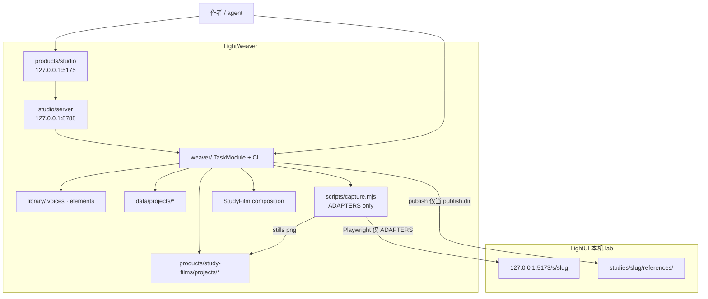
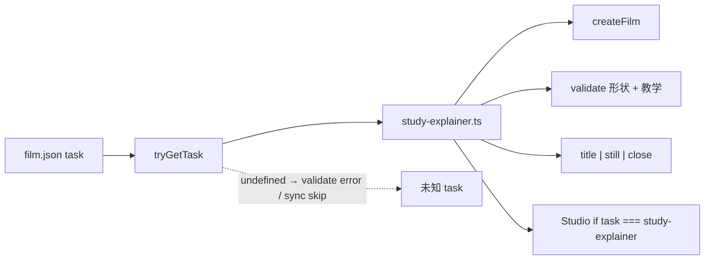
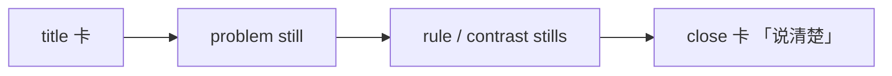
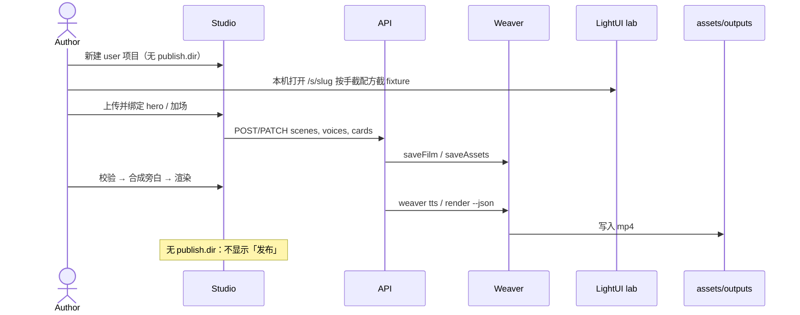

# LightWeaver 任务场景：先做 study-explainer

| 字段 | 值 |
| --- | --- |
| 文档标题 | LightWeaver 任务场景设计：教学讲解片优先 |
| 作者 | LightWeaver maintainers |
| 日期 | 2026-08-15 |
| 状态 | Draft |
| 范围 | LightWeaver 工作区；第一顾客为 LightUI `studies/` |
| 不实现 | `drama-plot` 运行时、MCP、Remotion Player、clip/overlay、通用 DAM、Vercel |

产品形状（理念 / 资产 / 产物 存放契约，agent 按图出片）见 [`design-placement-contract.md`](./design-placement-contract.md)。本文是任务核（TaskModule、FilmDoc、形状/媒体、CLI/HTTP），不重开。

两份不要合并成一篇。改任务核（D1–D13、CRUD、形状/媒体、`isRenderable`）先改**本文**；改存放图、skill 模式/阶段、recipe、LLM 归属、Studio 产品故事，改 [`design-placement-contract.md`](./design-placement-contract.md)。核保留，当 agent 调用的确定性 job API。

| 主题 | 本文（任务核） | `design-placement-contract.md` |
| --- | --- | --- |
| `task` / TaskModule / 循环禁令 | 拍板（D1–D2） | 继承 |
| 形状 vs 媒体 / `hero` / `isRenderable` | 拍板（D3、D4、D10） | QA 阶段去 **调用** |
| 一种 kind 一场、id=slug、lab 纯文本 | 拍板（D13） | recipe `taxonomy-parade` 落实 |
| CLI / HTTP / Studio CRUD | 拍板且已实现 | 降为 job API |
| 存放图（理念 / 资产 / 产物） | 只写了项目 layout 与 publish 边界 | **主场（P0）** |
| Skill 作为产品、模式、阶段 | 未覆盖 | 服务于存放图 |
| Recipe / template / composition 分层 | 未覆盖 | 方法资产，`recipes/study-explainer/` |
| LLM 住哪里 | 未覆盖 | P6（只住 agent 进程；`weaver/` 无模型） |
| Studio 产品故事 | 「人与 agent 同一面」偏工作台 | 改为复核面 |

---

## Overview

LightWeaver 已经从 LightUI 抽出稳定核（`weaver/`）、两部 first-party 片子、Studio 工作台和 Remotion 渲染器，但产品形态仍像「一份隐式的讲解片 JSON 编辑器」：项目没有任务类型，Studio 只能改旁白，第三部片子必须手改 `film.json`。这会把后续短剧剧情编排挤进同一套 `title | still | close` 时间线，最终滑向通用 NLE 或误并入 CineWeaver 成片剪辑。

本文把 **任务场景（task）** 做成项目的一等类型。当前只实现 `study-explainer`：面向 LightUI study 的双语教学讲解片——问题 → 规则 → 对照朴素做法 → 收束「说清楚」，静帧来自本机 lab，成片发布回 `studies/<slug>/references/`。Studio 与 CLI 提供同一组场景 CRUD / 绑静帧 / 改卡片 / 选音色 / 校验 / TTS / 渲染 / 发布，人与 agent 走同一 `--json` 面。`nav-taxonomy` 与 `sidebar-taxonomy` 先靠「手传 / 本机截屏 + 同一讲解模板」出片，不为两部未拍片上插件框架。`drama-plot` 只留注册点，不写空实现。

Studio「新建」与 CLI `create` 的默认闭环是 **本机渲染到 `assets/outputs/`**。只有配置了 `publish.dir` 的项目才出现「发布」、才拷到 LightUI `references/`。

---

## Background & Motivation

### 当前实现（已抽出、可跑）

| 层 | 路径 | 现状 |
| --- | --- | --- |
| 核 | `weaver/src/schema.ts` | `FilmDoc` 无任务类型；`SCENE_KINDS = title \| still \| close` 写死在全局 |
| 项目 | `weaver/src/project.ts` `createProject` | 用户片落到 `data/projects/`；种子已是 title+close、「说清楚」，但未声明自己是哪种任务 |
| 校验 | `weaver/src/validate.ts` | 旁白空 = error；`still` 无引用 = error；png 缺失 = warning；音色缺 = warning |
| CLI | `weaver/src/cli.ts` | `project list\|show\|validate\|create`、`asset list\|add`、`validate`、`sync`、`tts`、`render`。没有 scene 动词。无 id 的 `tts`/`render` 遍历 `listProjects()` |
| Studio | `products/studio/src/App.tsx` | 能改一行旁白、上传资产、跑 job；**不能**增删改序场景、绑 still、改 title/close 卡、选音色、单独发布。渲染按钮仅 `disabled={!detail \|\| busy}` |
| API | `products/studio/server/index.ts` | `PUT /film` 整文件覆盖；无 scene 粒度 PATCH。job 只允许 `tts` \| `render` |
| 渲染 | `products/study-films/src/Root.tsx` + `StudyFilm.tsx` | 读 `film.json` + wav 时长；composition 由 `weaver sync` 生成 |
| 截图 | `products/study-films/scripts/capture.mjs`（289 行） | Playwright **写死** `captureIntent` + `captureDropdown`，一次跑两部；没有 `--project`。`package.json` 的 `capture` / `films` 同样无项目 id |
| 发布 | `weaver/src/render.ts` `runRender` | 有 `film.publish.dir` 就 `path.join(uiRoot, dir, output)` 拷到 LightUI（**无** `safeJoin`）；无 `publish` 则跳过、不报错 |
| 片子 | `products/study-films/projects/{intent-cascade,dropdown-taxonomy}/` | 完整 film + stills + wav，校验通过。`assets/outputs/` 今日不存在、未提交 |

`FilmDoc` 今日形状（`weaver/src/schema.ts`）：

```ts
export type FilmDoc = {
  id: string;
  brand: string;
  publish?: { dir: string };
  capture?: { kind: string; slug: string };
  voices: Record<Locale, AssetRef>;
  locales: Record<Locale, LocaleCopy>;
  scenes: SceneDef[];
};
```

两部已拍片已经是 study-explainer 实例，只是没打戳：

- `intent-cascade`：`capture.kind = lightui-lab`，`publish.dir = studies/intent-cascade/references`，`locales.zh.output = cursor-movement.mp4`，场景 `title → problem → diagonal → vertical → third → close`。
- `dropdown-taxonomy`：同样结构，`output = source-tutorial.mp4`，场景是 **按 kind 对照**（select / multi / grouped / cascader / split / mega / date）+ close。

### 第一顾客：LightUI studies

LightUI 契约：

- 机器单元：`docs/study-contract.md`（`study.json` + `StudyView` + glob 发现，无注册表）。
- 人读单元与 **三问**（缺了什么会坏、规则是什么、朴素替代为什么更差）写在 `docs/conventions.md` 对 `idea.md` 的要求里，不是 `study-contract.md`。
- 片子 / 静帧是 lab fixture，**不提交进 LightUI**；`make films` 已转发到 LightWeaver（仅 Makefile 点名 LightWeaver，公开 README / lab 不提）。
- 四则：`intent-cascade`、`dropdown-taxonomy` 已有片；`nav-taxonomy`、`sidebar-taxonomy` 的 `references/SOURCE.md` 已点名 `source-tutorial.mp4` / `source-tutorial.en.mp4`，但 LightWeaver 里没有项目。
- 后两则 playground **已经**打了和 dropdown 同构的钩子：`data-kind`、`data-film="play"`、`data-film="fixture"`（`studies/nav-taxonomy/src/navs/Playground.tsx`、`Frame.tsx` 与 sidebar 对应文件）。九个 nav demo（含 Scrollspy / Shrink）都包在 `Frame` 里；滚动发生在 **fixture 内部**（约 22rem、`overflow-y-auto`），不是 `window`。

### 痛点

1. **第三部片子必须手改 JSON。** `skills/lightweaver-film/SKILL.md` 仍写「Edit `film.json` only」。这是当前产品闭环的断点，不是缺 MCP / Player。
2. **任务类型隐式。** 全局 `SCENE_KINDS` 把「讲解卡片」当成唯一宇宙。下一任务（短剧剧情）若继续往这里加 `beat` / `clip`，Studio 与 schema 会分叉成伪 NLE。
3. **截图脚本不是产品面。** `capture.mjs` 总是跑两部、不懂 `--project`，也没有「这部 study 还没有 adapter」的失败路径。为 nav / sidebar 再复制两份 `captureNav` / `captureSidebar` 能出图，但会把「出片」绑死在 Playwright 插件化之前。
4. **教学契约只活在文案里。** 片头「说清楚」、对照表、双语，全靠作者自觉。`createProject` 的 close 文案已经是教学口吻，但校验不强制 title 在首、close 在末。

---

## Goals & Non-Goals

### Goals

1. **任务类型一等。** `film.task` 标识任务；项目是某任务的实例。注册表可加第二种任务而不复制 `schema.ts` / Studio 壳。
2. **只实现 `study-explainer`。** 教学讲解片：双语、title/still/close、lab 静帧、发布回 LightUI references。
3. **闭合第三部片子环。** 人在 Studio、agent 用 CLI `--json`，都能增删改序 still 场景、绑定已上传或已截取的静帧、改片头片尾卡、选库音色、校验、TTS、渲染；有 `publish.dir` 时才能发布。
4. **`nav-taxonomy` / `sidebar-taxonomy` 可出片。** 不把 Playwright 插件框架当 Day-1 门槛。
5. **迁移零媒体重写。** 已有 png / wav 路径、asset id、scene id 保持不动。
6. **边界写死。** 短剧是未来任务，不是 CineWeaver 成片自动剪。

### Non-Goals（明确不做）

- 不实现 `drama-plot`（不准建空 `explore/`、空 task 文件、空 Remotion composition）。
- 不做 MCP、不做 Studio 内嵌 Remotion Player、不加 `clip` / `overlay` / `b-roll` scene kind。
- 不把 `library/` 做成通用 DAM（LightAsset）；不导入成片再自动剪（CineWeaver）；不调 LightTTS 训练面，只调用现有 `scripts/tts.py`。
- 不把引擎搬回 LightUI；不在 LightUI **公开页 / README** 提及兄弟私有仓库。
- 不从 `weaver/` import `products/*`；Studio 不 import Remotion 或 LightUI 源码。
- 不部署 Vercel；lab / Studio / API 继续绑 `127.0.0.1`。
- 不把四则 study 收成共享组件库；截图继续打 **运行中的** `http://127.0.0.1:5173/s/<slug>`，不用沙箱截图。

---

## Key Decisions

### D1 · 任务字段叫 `task`，第一值是 `study-explainer`

**选定：** `FilmDoc.task: "study-explainer"`。读盘时缺省视为 `"study-explainer"`；下次 `saveFilm` 写回。

**不叫 `taskType`：** 与现有 `scene.kind` / `asset.kind` / `capture.kind` 同一套「短名词 = 登记 id」；CLI `--task` 也更短。

**不叫 `lightui-film` / `lightui-study`：** 任务描述的是 **教学法 + 片子形态**，不是顾客仓库名。LightUI 是第一顾客，经由 `study.slug` + `publish.dir` + `capture` 连接，避免把核耦死在 `LIGHTUI_ROOT`。

**不叫裸 `explainer`：** 太容易变成通用幻灯片工具，诱使加 clip/overlay。

**未来第二值（只登记、不实现）：** `drama-plot` —— 场次 / 节拍 / 对白编排，仍是「先写场景再配资产」，不是导入成片。

### D2 · 扩展点是 TaskModule 注册表，不是「加全局 scene kind」

`weaver/src/tasks/` 登记任务。每个任务自带：允许的 scene kind、`createFilm` 种子、`validate` 增量。Studio 壳（项目列表、job、资产上传、校验条）共用。

**Day-1 缝合（一个已实现任务，禁止先做插件注册表）：**

- `TaskId` **只**定义在 `weaver/src/schema.ts` 的 `TASK_IDS`；`tasks/types.ts` re-export，不复制联合类型。
- Studio：`film.task === "study-explainer"`（或缺省）→ `<StudyExplainerPane/>`；否则只读 stub。第二种任务落地时再抽 pane map。
- **不**做 `TaskModule.summaryExtras`。`projectSummary` 在 `project.ts` 里硬编码增加 `task`、`studySlug?`。drama-plot 真做时再谈 hook。
- TaskModule **可以** import：`schema.ts` 类型、本地 `Issue` 构造（`err`/`warn` 可抽到 `schema.ts` / `issues.ts`）、`node:fs`、`paths.ts` 的 `lightuiRoot`（**不要** `requireLightuiRoot`，它在 LightUI 不在时 **throw**）。`createFilm` 读 `study.json`、`validate` 扫 SOURCE.md 时：若 `lightuiRoot()` 目录不存在，**跳过**这些软增强，不报错。
- **禁止** `study-explainer.ts` import `project.ts`、`validate.ts`、`assets.ts`。`assets.ts` 已 import `saveAssets` from `project.ts`，再引进来会形成 `project → registry → study-explainer → assets → project`。
- still 引用是否可解析、png 是否在盘：**只留在** `validate.ts`（今日 48–59 行）。`studyExplainer.validate` 只追加：title/close 位置、`kind=still` 场数 ≥ 1、D11 role、first-party slug、`publish.dir` 字符串、SOURCE.md 是否点名 `output`（有文件才看）。

禁止：在 `SCENE_KINDS` 里预留 `beat`；禁止为 drama 建空 composition。

### D3 · 教学契约是叙事，不是死锁 4 场

LightUI `idea.md` 的「问题 / 规则 / 对照 / 说清楚」（见 `docs/conventions.md` 三问）是 **叙事义务**，不是强制恰好四场 still。实证：

| 片子 | 结构 | 叙事怎么落 |
| --- | --- | --- |
| `intent-cascade` | title + problem + 3 rule/contrast still + close | 一场问题，斜向=规则，纵向=对照 delay，第三级=规则加深 |
| `dropdown-taxonomy` | title + 7 kind still + close | **整张对照表当场景列表**；close 点破 Grouped ≠ Cascader |

硬约束只覆盖 **形状**，级别与今日 `validate.ts` 对齐：

| 规则 | 级别 |
| --- | --- |
| 恰好一个 `title` 且位于 `[0]` | error（新增） |
| 恰好一个 `close` 且位于末尾 | error（新增） |
| `kind=still` 场数 ≥ 1 | error（新增，形状） |
| still 场缺少 `still` 引用 / 引用解析不到资产 | error（**今日已有**，`validate.ts` 48–52） |
| still 引用在、png 文件不存在 | warning（**今日已有**，53–59） |
| 某 locale 旁白空 | error（今日已有） |
| 某 locale 未指定音色 | warning（今日已有，28–31；**不是**硬约束） |
| 音色文件 / 旁白 wav 缺失 | warning（今日已有） |

**禁止** 为了「四个盒子」而把 7 个 kind 压成一场。

`role` 见 D11。

### D10 · 形状与媒体分离；种子一场未绑 still；测试只断言完成片

这是作者状态机，写在 Key Decisions，不塞进 PR 括号。

**形状（error）：** title/close 钉住；至少一场 `kind=still`；该场必须有可解析的 `still` 资产引用。

**媒体（warning）：** 引用指向的 png / wav 文件可以暂时不在磁盘上。与今日 `validate.ts` 一致。

**`createFilm` 种子：** `title` + **一场** `kind=still`（`id: "hero"`，**不**写 `still` 引用）+ `close`。旁白用标题 / 「说清楚」填满各 locale，避免一创建就因空行报错。创建后的状态是「再绑一张静帧即可变绿」（未绑 = error，Studio 禁渲染）。**不**从 LightUI `kinds.ts` 灌场。

**不要**把「零 still 场」降成 warning 来迁就骨架——种子已经带一场 still，形状规则保持严格。

**不要**发明 `film.status` 或 `it.skip`。

**`validate.test.ts`：** 把「catalog 无 error」收窄为 **完成片**：`capture.kind === "lightui-lab"` 且该片所有 still 引用的文件都在盘上（现网即 `intent-cascade` 与 `dropdown-taxonomy`）。`listProjects()` 仍可列出未完成 first-party；它们不进这条断言。另留一条：每个项目（含种子）必须能 `load`，未知 `task` 不得扔异常。

**first-party nav / sidebar 准入（PR5）：** 不得提交「只有 title+close」的目录，也 **不得** 留下种子场 `hero`。提交时必须已经有全部 kind 对应的 `kind=still` 行，每行带 `still: "asset:still.<kind>"`，且 `assets.json` 里有对应 stub（`files.zh` / `files.en` 指向 `assets/stills/{zh,en}/<kind>.png`）。**png 可以不在** → warning。旁白中英写好。形状为绿、媒体为黄；`isRenderable` 为 false，因此无参 `make films` 会跳过它们（见 D4）。

**从 CLI 长出 PR5（不要把 create 的 `hero` 提交进去）：**

```bash
npx weaver project create nav-taxonomy --task study-explainer --source first-party --study-slug nav-taxonomy \
  --output source-tutorial.mp4 --output-en source-tutorial.en.mp4
npx weaver scene add --project nav-taxonomy --id floating --kind still --still asset:still.floating --fit contain --role contrast
# …其余 kind 同理，并写入 assets.json stub 与中英旁白
npx weaver scene rm --project nav-taxonomy --id hero
```

也可以手写两份 `film.json`。无论哪条路，入库的场景列表里 **没有** `id: "hero"`。

### D4 · 未拍两则：先手传静帧 + 同一模板（方案 b）；操作矩阵

**Day-1 出片路径：方案 b。** 手截 / 上传静帧，走同一套 title/still/close。`capture.mjs` 继续只服务已写死的两则。

**不选 Day-1 方案 a（数据驱动 capture steps）的理由：**

1. 产品断点是「手改 JSON」，不是「不会截图」。
2. 两则未拍片的 playground **已经**有 `data-kind` / `data-film="fixture"`。
3. nav 的 scrollspy / shrink 的教学态是 fixture **内部滚动之后**（shrink 默认是未收缩大图；规则是过 40px 变矮）。通用 step DSL 会为这两个 kind 长出半个测试运行器。
4. 现有 `capture.mjs` **289** 行、两种完全不同的交互（指针轨迹 vs 打开 popover）。先抽已有的 `openLab` / `screenshotFixture` / `pickKind` 即可，不需要 plugin API。

**后置：** `film.capture.steps[]` 只在 schema 注释留位置，不读、不跑、不校验。

**「禁止再默认连跑」收窄为：** 指定 `--project` 时不得顺带跑兄弟 adapter。无参数默认仍是 `--all` = 只跑 `ADAPTERS` 的 key（今日 intent + dropdown），**不因为仓库里出现 nav 就 exit 2**。

统一谓词（放 `weaver/src/validate.ts`，`index.ts` 导出；**不**把缺 png 升级成 validate error）：

```ts
export function isRenderable(project: ProjectRecord, root = weaverRoot()): boolean {
  if (hasErrors(validateProject(project, root))) return false;
  return everyStillPngExists(project, root); // 每个 still 引用、每个 locale 的 png 都在盘上
}
```

PR5 骨架形状绿、png 黄 → `hasErrors === false` 且 `isRenderable === false`。无参 `make films` 必须按 `isRenderable` 跳过，不能按 `hasErrors`（否则会 TTS 11+7 场 × 2 locale，并把未提交的 wav 写进 first-party 目录）。

操作矩阵：

| 调用 | 行为 |
| --- | --- |
| `weaver capture --project X` | 只跑 X 的 adapter；无 adapter → exit 2 |
| `weaver capture` / `make films-capture` / npm `capture`（无 `PROJECT`） | **`--all`**：只跑 `ADAPTERS` 里的 slug。忽略 manual 片。不因 nav 存在而失败 |
| `weaver tts` / `render`（无 id）= LightUI `make films` 的后两步 | 遍历 `listProjects()`；`!isRenderable` → **跳过并打日志**。跳过 **不是** 失败。单片 throw 不中止其余。exit 2 **仅当**：某个 **未跳过** 的项目 throw，**或** 一个项目都没尝试到（全部 skip / 仓库里零完成片） |
| `weaver tts --project X` | **允许** `!isRenderable`。作者可以在 png 齐之前先出 wav |
| `weaver render --project X` | `!isRenderable` → **error**（不是 skip）：「静帧文件不存在：…；先按手截配方补 png」。**不准**进 Remotion（现网 `runRender` 只拦缺 wav，png 缺失会在 `staticFile` 炸） |
| Studio「渲染」 | 同 `render --project`：`!isRenderable` 禁用按钮；误触发 job 也要在进 Remotion 前 error |
| Studio「合成旁白」 | 与 `tts --project` 一致：有 error 可仍允许（只缺 png 时） |
| LightUI `make films` 等 | **不加新必选旗标**；tts/render 无 id 走 `isRenderable` skip。只改 LightUI **Makefile** 的可选 `PROJECT=` |
| npm `films` | capture `--all` + 无 id tts/render（skip `!isRenderable`） |

Day-1 不为 nav/sidebar 写 adapter。这两则的 LightUI `references/` **只收 mp4**，不收手截 png。`make films` 用 **已提交进 LightWeaver 的 stills+wav** 重渲 mp4；不会再生成这两则的 png。SOURCE.md / LightWeaver `docs/conventions.md` 必须写明这一点。手截配方见下文「手截配方」。

### D5 · 短剧是未来任务，不是 CineWeaver

| | LightWeaver `drama-plot`（未来） | CineWeaver |
| --- | --- | --- |
| 输入 | 场次剧本、节拍、对白、尚不存在或新拍的画面 | **已有**成片 / 素材 |
| 动作 | 编排场景 → 配资产 → 合成讲解/对白片 | AI 解说 + **自动剪** |
| 时间线 | 场景列表（与 explainer 一样是 script-first） | 剪辑时间线、切点、素材入出点 |

`drama-plot` 若落地，也走 TaskModule。本文不为它加字段、不建文件。

### D6 · first-party 只由 CLI 创建；Studio「新建」仍写 `data/projects/`

与现网一致（`createProject` 默认 `source: "user"`；Studio `POST /api/projects` 不传 source）。`nav-taxonomy` / `sidebar-taxonomy` 用：

```bash
npx weaver project create nav-taxonomy \
  --task study-explainer \
  --source first-party \
  --study-slug nav-taxonomy
```

落到 `products/study-films/projects/<id>/`。Studio 可以 **编辑** first-party，不能从 UI 往 `study-films/projects` 里乱建。

`create` 会带上种子场 `hero`。first-party 入库前必须 `scene add` 齐 kind、`scene rm --id hero`（见 D10）。**提交的 `film.json` 里不得有 `hero`。**

`createFilm` **不**根据 slug 猜测成片文件名（intent 是 `cursor-movement.mp4`，不是 `intent-cascade.mp4`）。默认仍是今日的 `${id}.mp4` / `${id}.en.mp4`（用户片）。first-party 骨架的 `locales.*.output` **必须按该则 `SOURCE.md` 手写**（create 时 `--output` / `--output-en`，或 PR5 手改）。禁止静默改 intent 的 `cursor-movement.mp4`。

校验 **warning**：`source === "first-party"` 且 `LIGHTUI_ROOT/studies/<slug>/references/SOURCE.md` 存在，但文件正文未出现该 locale 的 `copy.output`。

### D7 · 身份字段 `study.slug`，capture / publish 拆开

今日 `capture.slug` 身兼「这是哪则 study」和「怎么截图」。

规范化（读盘兼容旧字段）：

```ts
study?: { slug: string };           // 任务身份；有发布目标时必写
capture?: { kind: "lightui-lab" | "manual"; slug?: string }; // 旧 slug 仍可读
publish?: { dir: string };
```

- 缺 `study.slug` 时回退 `capture.slug`。
- **新 manual 片：** `capture: { kind: "manual" }`，**不写** `capture.slug`。身份只在 `study.slug`。
- **已有 lab adapter 的旧片：** 保留 `capture: { kind: "lightui-lab", slug }` 以兼容。
- `createFilm`：传入 `studySlug` 且 slug ∈ `LIGHTUI_LAB_ADAPTERS` → `lightui-lab` + slug；否则若有 slug → `study.slug` + `{ kind: "manual" }`（无 slug 键）+ `publish.dir = studies/<slug>/references`；用户新建无 slug → 无 `study`、无 `publish`、`capture: { kind: "manual" }`。
- `publish.dir` 有 slug 时由 create **显式写出**，不靠读盘推导。

### D8 · 人机同一命令面，整文件 PUT 降为逃生舱

每个写操作有 CLI 动词 + HTTP 细端点 + `--json`。`PUT /api/projects/:id/film` 保留给迁移 / 灾难恢复。Studio 日常结构编辑只用 PATCH。PATCH 的 locale 级合并见 API 节，禁止 `{ ...scene, ...patch }` 冲掉另一语种旁白。

### D9 · YAGNI 清单

不准：MCP、Remotion Player 嵌入、clip/overlay kind、空 `explore/`、`library/` 变 DAM、Vercel、CineWeaver import、LightUI 公开页出现本仓库名以外的私有兄弟仓、为 drama 预留空 scene kind。

### D11 · `role` 是可选糖；无 role 不警告

`scenes[].role?: "problem" | "rule" | "contrast"` 不参与渲染。

- 整部片子 **一个 role 都没有** → 不警告（今日两部已拍片即此状态，直到打戳 PR）。
- **至少写了一个** role → 检查覆盖：须同时能看到 problem 叙事与 contrast 叙事。满足任一即通过：（a）存在 `role=problem` 且存在 `role=contrast`；（b）**每一场** still 都是 `role=contrast`（taxonomy 对照表）。否则 warning，不 error。
- 引入这条 warning 的 **同一个 PR** 必须给已拍片打 role：`intent-cascade` 为 `problem=problem`、`diagonal=rule`、`vertical=contrast`、`third=rule`；`dropdown-taxonomy` 七场 kind 全 `contrast`。

### D12 · 无 `publish.dir` 的项目只做本机渲染

阶段 2（Studio 闭环、尚无 first-party nav 目录）是 **本地 `assets/outputs/`**。

- `runPublish`：无 `publish.dir` → 明确 error「未配置 publish.dir；user 片只渲染到 assets/outputs」。
- `runRender`：无 `publish.dir` 仍跳过拷贝、不报错（与今日 `render.ts` 88–97 一致）。
- Studio：**没有** `publish.dir` 时隐藏「发布」按钮，不调用 publish API。
- Studio「渲染」按 `!isRenderable` 禁用（不只是 `hasErrors`）。缺 png 的 first-party 骨架可以显示「发布」按钮（`publish.dir` 已有），但点渲染必须先被挡住。
- 不在 Studio 新建表单上做「发布目标」编辑器（YAGNI）。要发布到 LightUI，用 CLI `--study-slug` 建 first-party，或以后再加表单。

### D13 · 已拍板的产品分叉（原 Q1–Q3）

- **一种模型一场。** `nav-taxonomy` / `sidebar-taxonomy` 与 dropdown 一样，每个 kind 一场 still。口播若超过约 2 分钟再砍场，**不**预置短版 schema。
- **first-party id = slug = 目录名。** `film.id === study.slug ===` 项目目录名。create 不提供分离入口。
- **Studio 显示 lab 纯文本 URL。** 有 `study.slug` 时展示 `http://127.0.0.1:5173/s/<slug>`，不内嵌 lab / Player。

---

## Proposed Design

### 系统位置



### 任务注册



新文件（只建 study-explainer，不建 drama 空壳）：

```
weaver/src/tasks/types.ts       TaskModule 接口（TaskId 从 schema re-export）
weaver/src/tasks/registry.ts    TASKS 表 + getTask + tryGetTask + listTasks
weaver/src/tasks/study-explainer.ts
products/studio/src/tasks/study-explainer.tsx   场景主编辑
```

`weaver/src/schema.ts`（`TaskId` 唯一定义处）：

```ts
export const TASK_IDS = ["study-explainer"] as const;
export type TaskId = (typeof TASK_IDS)[number];
```

`weaver/src/tasks/types.ts`：

```ts
import type { FilmDoc, Issue, ProjectRecord, ProjectSource, TaskId } from "../schema.ts";
export type { TaskId };

export type TaskModule = {
  id: TaskId;
  label: { zh: string; en: string };
  sceneKinds: readonly string[];
  createFilm: (input: {
    id: string;
    title?: string;
    brand?: string;
    studySlug?: string;
    source?: ProjectSource;
    output?: string;
    outputEn?: string;
  }) => FilmDoc;
  validate: (project: ProjectRecord, root: string) => Issue[];
};

export function isImplementedTask(id: string): id is TaskId {
  return (TASK_IDS as readonly string[]).includes(id);
}
```

`registry.ts`：

```ts
export function tryGetTask(id?: string): TaskModule | undefined {
  const key = id ?? "study-explainer";
  return TASKS[key as TaskId];
}

/** 仅写路径：create / addScene。缺省 → study-explainer；未知 → throw */
export function getTask(id?: string): TaskModule {
  const task = tryGetTask(id);
  if (!task) {
    throw new Error(`未知任务类型：${id}。已实现：${Object.keys(TASKS).join(", ")}`);
  }
  return task;
}
```

**读 / 校验路径禁止 throw：**

- `validateProject` 用 `tryGetTask` / `isImplementedTask`：未知或未实现 → `err("task", ...)`，继续跑通用检查。
- `syncRemotion`：`tryGetTask` 失败则跳过该项目并 warning，不写 catalog。
- `loadProject` / `listProjects` / `GET /api/projects/:id` 只 `normalizeFilm`，不 `getTask`。
- `createProject` / `addScene` 可用 `getTask` throw。
- `PUT /film`：未实现 task → **400**，在 handler 里判，不经过会 throw 的 `getTask`。

`drama-plot` **预留形状（文档 only）**：现在不建文件。第二种任务落地时往 `TASK_IDS` 加字面量、加模块、Studio 再抽 pane map。

### study-explainer 教学形态

片子是 **说清楚一则 study**，不是幻灯片皮肤。



对照四则 study 的推荐场景（后两则是设计；PR5 提交 kind 行，png 可后补）：

| slug | 已有 / 建议场景 id | 叙事 |
| --- | --- | --- |
| `intent-cascade` | title, problem, diagonal, vertical, third, close | 问题 → 走廊规则 → 纵向对照 delay → 第三级 → 收束 |
| `dropdown-taxonomy` | title + 7 kind + close | 提交模型对照表；close 点破 Grouped ≠ Cascader |
| `nav-taxonomy` | title + 9 kind（floating, sidebar, breadcrumb, dropdown, mega, drawer, overlay, scrollspy, shrink）+ close | 住在哪 / 怎么开 / 滚什么；close 点破三对易混 |
| `sidebar-taxonomy` | title + 5 kind（floating, wheel, multilevel, collapsible, offcanvas）+ close | 占位 / 变宽 / 盖上来；close 点破两对易混 |

片长量级（按现网 `timeline.ts`：中文 ≈ 4.2 字/秒，英文 ≈ 14 字/秒，+0.55s，最少 60 帧，wav 优先）：

- intent：6 场 × ~8–12s ≈ **50–70s** / locale
- dropdown：9 场 ≈ **70–100s**
- nav：11 场 ≈ **90–130s**（可接受；不要为了短而砍 kind）
- sidebar：7 场 ≈ **60–80s**

**D13：** 按上表 **一种 kind 一场**，与 dropdown 一致。口播超过约 2 分钟再砍，不预置短版 schema。

种子 `createFilm`（`study-explainer.ts`，替换今日 `project.ts` 内联对象）：

- `task: "study-explainer"`
- `brand`: first-party 默认 `LightUI`，user 默认 `LightWeaver`
- `voices`: `library:voice.prompt-zh` / `library:voice.prompt-en`
- `study.slug` / `publish` / `capture`：按 D7
- `locales.*.output`：默认 `${id}.mp4` / `${id}.en.mp4`；若传入 `output` / `outputEn` 则用之
- `locales.*.titleCard.kicker`: `LightUI  ·  Study` 或 `LightWeaver  ·  Film`
- `locales.zh.closeCard.headline`: `说清楚`；en: `Say it this way`
- 场景：`title` + `{ id: "hero", kind: "still", lines: { zh: title, en: title } }`（**无** `still` 键）+ `close`

可选：用 `fs` + `lightuiRoot()`（不要 `requireLightuiRoot`）读 `studies/<slug>/study.json` 的 `title` / `titleEn` / `summary` / `summaryEn` / `asks` 填卡片。目录不存在或读失败则用 `--title`，**不 throw**。**不**读 `kinds.ts`。

### 第三部片子闭环



first-party（CLI `--study-slug`）在渲染成功后可再 `weaver publish` 或点「发布」，把 **mp4** 拷到 `studies/<slug>/references/`。

操作矩阵（人 = Studio；agent = CLI `--json`；同一 weaver 函数）：

| 操作 | CLI | HTTP | Studio |
| --- | --- | --- | --- |
| 列任务 | `weaver task list` | `GET /api/tasks` | 新建时只展示已实现任务 |
| 建项目 | `weaver project create <id> --task study-explainer [--source first-party] [--study-slug] [--title] [--output] [--output-en]` | `POST /api/projects` body 可含 `task`、`title`；**忽略 source**，恒 user | 新建：id / 标题 / 任务只读 study-explainer |
| 列 / 看 | 现有 `project list\|show` | 现有 GET | 侧栏；summary 增 `task` |
| 加 still 场 | `weaver scene add --project <id> --id floating --kind still [--after title] [--role contrast]` | `POST /api/projects/:id/scenes` | 「加静帧场」插在 close 前 |
| 删场 | `weaver scene rm --project <id> --id floating` | `DELETE .../scenes/:sceneId` | 删除；title/close 禁用；不得删光最后一场 still |
| 调序 | `weaver scene move --project <id> --id floating --after sidebar` | `POST .../scenes/:sceneId/move` | 上移 / 下移（title/close 钉住） |
| 旁白 | `weaver scene set --project <id> --id floating --locale zh --text "..."` | `PATCH .../scenes/:sceneId` `{ lines: { zh: "..." } }` | textarea onBlur → PATCH 单语 |
| 绑静帧 | `weaver scene set --project <id> --id floating --still asset:still.floating --fit contain` | `PATCH` `{ still, fit }` | 下拉本项目 still + 「上传并绑定」 |
| 教学 role | `weaver scene set --project <id> --id floating --role contrast` | `PATCH` `{ role }` | 可选 role 选择器 |
| 片头/片尾卡 | `weaver card set --project <id> --locale zh --which title --headline ...` | `PATCH /api/projects/:id/cards` | 选中 title/close 时显示卡片表单 |
| 选音色 | `weaver voice set --project <id> --locale zh --ref library:voice.prompt-zh` | `PATCH /api/projects/:id/voices` | 工具条 locale 旁下拉库内 `kind=voice` |
| 校验 | `weaver validate <id>` | 现有 | 现有「校验」 |
| TTS / 渲染 | 无 id 走 `isRenderable` skip；`tts --project` 允许缺 png；`render --project` 遇 `!isRenderable` error | 现有 jobs（仅 tts \| render） | 「合成旁白」允许只缺 png；**`!isRenderable` 禁渲染** |
| 只发布 | `weaver publish --project <id> [--locale]` | `POST /api/projects/:id/publish` **同步**，不加 job type | 仅当 `publish.dir` 存在时显示 |
| 截图 | `weaver capture [--project <id>] [--locale]` | 不做 job | 无按钮；文案指向上传 / 手截配方 |

`scene add` 规则（study-explainer）：

- `kind` 只能是 `still`（title/close 由种子创建，禁止再加第二个）。
- 默认插入 `close` 之前。
- `--still` 可后绑。未绑时 `validate` **error**（与今日 `validate.ts` 第 48–51 行一致）。
- 删 title/close → error。删光最后一场 still → error（保持形状）。
- `move` 不得把 title 移离 `[0]`、不得把 close 移离末尾。

`--json` 写操作统一信封：

```json
{
  "ok": true,
  "project": { "id": "nav-taxonomy", "task": "study-explainer", "scenes": 3 },
  "film": { "...": "完整 FilmDoc" },
  "issues": []
}
```

失败：非 0 退出；`--json` 打印 `{ "ok": false, "error": "..." }`。`validate` 有 error 时 exit 2（保持现状）。

### PATCH / `patchScene` 合并语义

禁止浅合并整份 `SceneDef`。按字段：

| 字段 | 合并 |
| --- | --- |
| `lines` | `{ ...scene.lines, ...patch.lines }`，**按 locale 键**合并。PATCH `{ lines: { zh: "…" } }` 不得删除 `lines.en` |
| `still` / `fit` / `role` | 键出现则替换；省略则保留。`role: null` 显式清空（可选；Day-1 可不实现清空） |
| 其它 SceneDef 键 | 忽略或 400，避免把 `id`/`kind` 改掉 |

`setCard(locale, which, patch)`：

- 并入 `locales[locale].titleCard` 或 `closeCard`。
- `which=close` 时若 body 含 `kicker` 或 `tags` → 400（schema 是 `Pick<CardCopy, "headline" | "lede">`）。

`setVoice(locale, ref)`：只替换 `voices[locale]`。

HTTP：`lines` 不是 object → 400。测试：PATCH 只改 zh，读回 en 仍在。

### capture.mjs 怎么改、怎么不改

保持产品级脚本，**不**搬进 `weaver/`（weaver 不得 import products）。

Day-1：

1. 抽出已有 `openLab` / `screenshotFixture` / `pickKind`。
2. `--project <id>`：只跑对应 adapter；无则 exit 2。
3. 无 `--project`：等价 `--all`，只跑表内 key。

```js
const ADAPTERS = {
  "intent-cascade": captureIntent,
  "dropdown-taxonomy": captureDropdown,
};
```

4. `weaver capture` spawn `filmsProductRoot()/scripts/capture.mjs`。
5. LightWeaver `Makefile` 与 LightUI `Makefile`：可选 `PROJECT=`；缺省不传，保持今日「一条命令重生已拍两则」。
6. weaver 侧常量 `LIGHTUI_LAB_ADAPTERS = ["intent-cascade", "dropdown-taxonomy"]`，测试与 `ADAPTERS` 锁齐。不 import `capture.mjs`。

**不**在 Day-1 为 nav/sidebar 写 `captureNav`。上传 / 手截只写项目 `assets/stills/<locale>/`。今日 `dests()` 对 **adapter** 路径双写 zh png 到 LightUI `references/` 保持不变（历史便利，仅 intent/dropdown）。新两则不双写。

后置 steps 草图（不实现、不校验）略，见上一稿意图：`open` / `click` / `shot`。scrollspy / shrink 需要滚 fixture 内部，是 DSL 推迟的直接原因。

### 手截配方（nav / sidebar，PR6 / PR7 写成一页）

目标：视觉上靠近已拍两则（Playwright 1440×1100、`deviceScaleFactor: 2`、`reducedMotion: "reduce"`、`lightui-theme=light`、locale 走 `localStorage`），而不是随便 ⌘⇧4。

1. lab：`http://127.0.0.1:5173/s/<slug>`，light 主题。
2. 视口 **1440×1100**，设备像素比 **2**。中英各跑一遍（`localStorage.lightui-locale`）。
3. 点 `[data-kind=<kind>]`，等 `[data-film=fixture]` 稳定。
4. **shrink：** 在 fixture **内部**滚过约 40px，拍收缩后的顶栏，不要拍默认大图。
5. **scrollspy（可选加强）：** 在 fixture 内部滚到非第 0 节，让高亮跟手；没有把握就拍默认节，旁白不要声称「滚到了第二节」。
6. clip `[data-film=fixture]`（含 16px pad，对齐现网 `screenshotFixture`）。
7. 写入 `assets/stills/{zh,en}/<kind>.png`。文件名 = LightUI `kinds.ts` 的 `id`（`floating.png`、`drawer.png`），**不要**再用 `comp-01.png`。
8. `assets.json`：`id: "still.<kind>"`，`files.zh` / `files.en` 指向上面路径。`scenes[].still = "asset:still.<kind>"`。
9. 允许本机一次性 Playwright 片段，**不进 git**。

数量：nav 9 kind × 2 locale = 18；sidebar 5 × 2 = 10。LightUI `references/` **只放** `source-tutorial.mp4` 与 `.en.mp4`，不放这些 png。

### Remotion

`StudyFilm` 继续是 **唯一** composition。catalog 不必含 `task`。`role` 不改画面。

未知 `task`：`validate` error，`sync` 用 `tryGetTask` 跳过并 warning。

### Studio 信息架构（study-explainer pane）

```tsx
{task === "study-explainer" || !task ? (
  <StudyExplainerPane ... />
) : (
  <p>此任务尚未实现编辑器（{task}）</p>
)}
```

三栏保持。主栏：

1. **场景列表：** kind 徽章、id、role（若有）、旁白 48 字预览、上移下移。
2. **选中 title：** kicker / headline / lede / tags + 旁白。
3. **选中 still：** 绑 still、fit、role、旁白。
4. **选中 close：** headline / lede + 旁白（无 kicker/tags）。
5. **教学条（非阻塞）：** 仅当至少有一个 `role` 时按 D11 点亮。
6. **工具条：** locale、音色、校验、合成、渲染（`!isRenderable` 禁用）；**有 `publish.dir` 才显示发布**。
7. **资产页：** 上传 still 后可勾「绑到当前场景」。
8. 有 `study.slug` 时纯文本展示 `http://127.0.0.1:5173/s/<slug>`（D13）。不内嵌 lab / Player。

### Agent skills

- **PR2：** `skills/lightweaver-film/SKILL.md` 换成 scene / card / voice / create 旗标动词表；删「Edit film.json only」。
- **PR7：** 同一文件补叙事闭环（手截配方、无 adapter 时不要等 capture、user 片只本地渲染）。
- `skills/lightweaver` 路由表加「任务类型 / 第三部片子」→ film skill。

---

## API / Interface Changes

### Schema（`weaver/src/schema.ts`）

```ts
export const TASK_IDS = ["study-explainer"] as const;
export type TaskId = (typeof TASK_IDS)[number];

export const STUDY_SCENE_KINDS = ["title", "still", "close"] as const;
export type StudySceneKind = (typeof STUDY_SCENE_KINDS)[number];

/** 兼容旧 import；不再表示「所有任务的 kind」 */
export const SCENE_KINDS = STUDY_SCENE_KINDS;
export type SceneKind = StudySceneKind;

export const STUDY_ROLES = ["problem", "rule", "contrast"] as const;
export type StudyRole = (typeof STUDY_ROLES)[number];

export const CAPTURE_KINDS = ["lightui-lab", "manual"] as const;

export type SceneDef = {
  id: string;
  kind: string; // 由 TaskModule.sceneKinds 校验
  still?: AssetRef;
  voice?: AssetRef;
  fit?: "cover" | "contain";
  role?: StudyRole;
  kicker?: string;
  headline?: string;
  lede?: string;
  tags?: string[];
  lines: Record<Locale, string>;
};

export type FilmDoc = {
  id: string;
  task?: TaskId | string; // 缺省 = study-explainer
  brand: string;
  study?: { slug: string };
  publish?: { dir: string };
  capture?: { kind: string; slug?: string };
  voices: Record<Locale, AssetRef>;
  locales: Record<Locale, LocaleCopy>;
  scenes: SceneDef[];
};
```

`isSceneKind` 改为 `taskAllowsKind(task, kind)`（未知 task 时仍用 `STUDY_SCENE_KINDS` 做尽力检查，不 throw）。

`projectSummary` 增加 `task`、`studySlug?`（硬编码，非 TaskModule hook）。

`isRenderable` 与 `everyStillPngExists` 放在 `validate.ts`，与 `hasErrors` 一起导出。GET `/api/projects/:id` 的 JSON 增加 `renderable: boolean`（或 Studio 用 issues + 资产列表自己算；推荐服务端算一次，避免前后端对「每个 locale 的 png」理解不一致）。

### weaver 函数

`weaver/src/scenes.ts`：`addScene` / `removeScene` / `moveScene` / `patchScene` / `setCard` / `setVoice`（签名同上一稿，合并规则见上）。全部 `saveFilm`。

`createProject` 改为 `getTask(options.task).createFilm(...)`，接受 `source` / `studySlug` / `output` / `outputEn`。

`runPublish`（从 `render.ts` 抽出，`index.ts` **导出**）：

1. 无 `publish.dir` → throw 上述中文 error。
2. `copy.output` 含 `/` 或 `..` → throw。
3. `destDir = safeJoin(lightuiRoot(), publish.dir)`（weaver 侧实现，与 Studio `safeJoin` 同语义）。
4. 目标文件 = `path.join(destDir, path.basename(copy.output))`。
5. 源文件必须已在 `assets/outputs/<output>`；否则 throw「先 render」。

`runRender`：指定项目且 `!isRenderable` → throw，不调 Remotion。无 id 的 CLI 循环在调用前 skip。成功后若有 `publish.dir` 仍调用 `runPublish`。无 dir 跳过拷贝。

`.gitignore` 增加 `**/assets/outputs/`。

### CLI（`weaver/src/cli.ts`）—— **PR2 起** 增加旗标

`task`、`source`、`study-slug`、`output`、`output-en`、`after`、`before`、`index`、`still`、`fit`、`role`、`which`、`headline`、`lede`、`kicker`、`tags`、`ref`。

```
weaver task list
weaver project create <id> --task study-explainer [--title] [--source user|first-party] [--study-slug] [--output] [--output-en]
weaver scene list|add|rm|move|set --project <id> ...
weaver card set --project <id> --locale zh --which title|close ...
weaver voice set --project <id> --locale zh --ref library:voice.prompt-zh
weaver publish --project <id> [--locale]          # PR3
weaver capture [--project <id>] [--locale]        # PR3
```

无 `--task` 默认 `study-explainer`。

### HTTP（`products/studio/server/index.ts`）

| 方法 | 路径 | 说明 |
| --- | --- | --- |
| GET | `/api/tasks` | `listTasks()` 的 id + label |
| POST | `/api/projects` | `task`、`title`；**忽略 source** |
| POST | `/api/projects/:id/scenes` | add |
| DELETE | `/api/projects/:id/scenes/:sceneId` | rm |
| POST | `/api/projects/:id/scenes/:sceneId/move` | `{ after \| before \| index }` |
| PATCH | `/api/projects/:id/scenes/:sceneId` | 按字段合并；`lines` 必须是 object |
| PATCH | `/api/projects/:id/cards` | `{ locale, which, headline, lede, kicker?, tags? }` |
| PATCH | `/api/projects/:id/voices` | `{ locale, ref }` |
| POST | `/api/projects/:id/publish` | **同步**调用 `runPublish`；**不**加 `Job["type"]` |
| PUT | `/api/projects/:id/film` | 逃生舱；未实现 task → 400 |

`Job["type"]` 保持 `"tts" | "render"`。`saveLine` 改为 PATCH 单场单语。`startJob("render")` 在 spawn 前若 `!isRenderable` 直接标 error（与 CLI 同一句中文），避免空跑 Remotion。

`index.ts`（weaver）必须导出：`addScene`、`removeScene`、`moveScene`、`patchScene`、`setCard`、`setVoice`、`listTasks`、`tryGetTask`、`getTask`、`isRenderable`、`runPublish`（PR3）、`LIGHTUI_LAB_ADAPTERS`。Studio 只从 `@lightweaver/weaver` 引用。

---

## Data Model Changes

### 读盘规范化

`loadProjectAt` 之后只规范化，不 `getTask`：

```ts
function normalizeFilm(film: FilmDoc): FilmDoc {
  const task = film.task ?? "study-explainer";
  const slug = film.study?.slug ?? film.capture?.slug;
  return {
    ...film,
    task,
    study: slug ? { slug } : film.study,
  };
}
```

不在 `load` 时写回。`saveFilm` 写规范化后的文档。

### 两部旧片迁移（不碰媒体）

只加 `task` / `study`（PR1）。`role` 在引入 D11 warning 的同一 PR 打上（与 PR1 合并：PR1 已改这两份 `film.json`，把 role 一并写入，warning 也在 PR1 的 `studyExplainer.validate` 落地）。

```json
{
  "id": "intent-cascade",
  "task": "study-explainer",
  "brand": "LightUI",
  "study": { "slug": "intent-cascade" },
  "publish": { "dir": "studies/intent-cascade/references" },
  "capture": { "kind": "lightui-lab", "slug": "intent-cascade" }
}
```

intent still `role`：`problem=problem`，`diagonal=rule`，`vertical=contrast`，`third=rule`。dropdown 七场 kind 全 `contrast`。不改 `assets.json`、png/wav、asset id。

### 新 first-party 目录（PR5 形状）

```
products/study-films/projects/nav-taxonomy/film.json
products/study-films/projects/nav-taxonomy/assets.json
products/study-films/projects/sidebar-taxonomy/...
```

`film.json` 必须含：

- `task`、`study.slug`、`capture.kind: "manual"`（无 `capture.slug`）
- `publish.dir`: `studies/<slug>/references`
- `locales.zh.output`: `source-tutorial.mp4`；`locales.en.output`: `source-tutorial.en.mp4`（与 SOURCE.md 一致，**手写**）
- 场景：title + 每个 kind 一场 still（`id` = kind，`still: "asset:still.<kind>"`，`fit: "contain"`，中英旁白）+ close。**没有** `hero`
- kind still 的 `role: "contrast"`

`assets.json`：每个 `still.<kind>` 的 `files` 指向 `assets/stills/{zh,en}/<kind>.png`。**目录可空、png 可不提交。**

### 校验增量

现有 error/warning **级别保留**。still 引用 / png 是否存在 **只**在 `validate.ts` 里查。`studyExplainer.validate` 追加：

| 级别 | 条件 |
| --- | --- |
| error | `task` 存在且 `!isImplementedTask`（不 throw） |
| error | scene.kind 不在任务允许集合 |
| error | title 数量 ≠ 1 或不在 index 0 |
| error | close 数量 ≠ 1 或不在末尾 |
| error | `kind=still` 场数为 0 |
| error | first-party 且无 `study.slug` 又无 `capture.slug` |
| warning | 有 slug 但无 `publish.dir` |
| warning | `publish.dir` 不是 `studies/<slug>/references` |
| warning | first-party 且 SOURCE.md 存在但不含 `copy.output` |
| warning | **至少一个** `role` 已写，且覆盖不满足 D11 |
| warning | `capture.kind=lightui-lab` 但 slug 不在 `LIGHTUI_LAB_ADAPTERS` |

### 回滚

去掉 `task` / `study` / `role` 即可被旧 `loadProject` 读取。新媒体未移动。gitignore 的 `assets/outputs` 可留。

---

## Alternatives Considered

### A1 · 继续无任务类型，只加 scene CRUD

- 优点：改动面最小。
- 缺点：`SCENE_KINDS` 仍是全局真理；Studio 会长成通用时间线。
- **弃：** CRUD 必须挂在 task 下。

### A2 · 每任务一个产品

- 优点：边界极清。
- 缺点：工作台复制。当前只一个任务。
- **弃：** 一个 Studio + TaskModule。

### A3 · Day-1 数据驱动 capture / 每则一个 adapter

- 优点：`make films` 一条龙复现静帧。
- 缺点：nav 滚动态会撑爆 DSL；出片被截图阻塞。
- **弃作 Day-1。** 手截配方 + 提交 png 后由 `make films` 只重渲 mp4。

### A4 · 片子搬回 LightUI `studies/<slug>/`

- 缺点：刚抽出；媒体会进 study 目录。
- **弃。**

### A5 · 零 still 场降为 warning / `it.skip` / `film.status`

- 能让空骨架过 CI，但与「至少一场 still」和完成片测试打架。
- **弃：** D10 种子带 `hero`；first-party 提交时已有 kind 行 + 资产 stub。

---

## Security & Privacy Considerations

| 威胁 | 现网控制 | 本设计 |
| --- | --- | --- |
| 路径穿越读盘 | Studio `safeJoin` 限制 library / project root | 新端点只改 JSON；上传仍走 `ingestUpload` |
| 把 Studio 绑到公网 | Vite / API 默认 `127.0.0.1`；CORS 仅 localhost | 不改 |
| 任意拷贝到盘外 | `runRender` 现为裸 `path.join(uiRoot, dir, output)` | `runPublish`：`safeJoin(lightuiRoot(), dir)` + `basename(output)`；`output` 含 `/` 或 `..` 拒绝 |
| capture 打非 lab 主机 | `LAB_URL` 默认 `http://127.0.0.1:5173` | 非 loopback → error |
| 整文件 PUT 覆盖 | 无乐观锁 | 日常 PATCH；PUT 仍无锁 |
| 在 LightUI 公开页泄露兄弟仓 | LightUI `AGENTS.md` 禁止 | 只改 LightUI Makefile；`publish` 只拷 mp4 |
| 上传 40MB | multer limit 已有 | 不变 |

无账号模型。TTS 凭证处理不改。

---

## Observability

本机工具，不做远程 APM。

| 信号 | 怎么记 | 告警 / 阈值 |
| --- | --- | --- |
| CLI 写操作 | `--json` 含 `ok` + `issues` | exit 0/1/2 |
| 校验 | `Issue[]`；error→exit 2 | Studio 列表；`!isRenderable` **禁用渲染**（今日只看 busy；本设计加上） |
| Job | `jobs.ts`：缓冲到 80_000 再裁成末尾 60_000 | 现有 status 预览 |
| capture | `wrote` 日志 | `--project` 无 adapter → 非 0；`--all` 不因 manual 片失败 |
| publish | `onLog('published ${path}')` | 无 dir / 越界 / 无 mp4 即抛 |
| 性能 | validate < 100ms | TTS 数秒～十几秒/句；渲染每 locale 约 1–3 min |
| 容量 | still 5–10 × 2 locale × ~0.3–1MB；wav 6–11 × 2 | 不设配额；mp4 进 gitignore |

---

## Rollout Plan

无 feature flag。按文末 PR。

**阶段 0 — 兼容：** `normalizeFilm` + `tryGetTask`。旧片不改也能 load / tts / render。

**阶段 1 — 戳 + 注册表：** 两部旧片 `task`/`study`/`role`；`createProject` 走 TaskModule（种子含 `hero`）。

**阶段 2 — 闭环：** CLI 动词 + HTTP + Studio pane。用户片用上传静帧 **渲染到 `assets/outputs/`**。无「发布」除非后来手改 `publish.dir`。

**阶段 3 — 骨架：** PR5 提交 nav/sidebar 的 kind 行 + stub（无 png）。`validate.test` 只盯完成片。

**阶段 4 — 出片：** 手截 png、tts、render、publish mp4。

**阶段 5 — capture 收口：** `--project` 与 `--all`。不写 nav adapter。

**回滚：** 还原新增 JSON 键；媒体未移动；gitignore 可留。

**风险：**

| 严重度 | 风险 | 缓解 |
| --- | --- | --- |
| 高 | Studio 长成通用时间线 | Day-1 只 `if (task === "study-explainer")`；对照 D9 |
| 高 | weaver import LightUI `kinds.ts` | 禁止；PR5 手写旁白与 kind id |
| 中 | `PUT /film` 与 PATCH 互盖 | Studio 结构编辑只用 PATCH |
| 中 | 无参 capture 弄坏 LightUI `make films` | 无参 = `--all` adapters；有 `--project` 才单跑。落实在 **PR3** |
| 中 | 无参 tts/render 碰到 PR5 骨架 | 按 `isRenderable` skip；skip 不算失败；PR3 落地，勿等 PR6 |
| 中 | nav 11 场过长 | D13：一种 kind 一场；口播超过约 2 分钟再砍，不预置短版 |
| 低 | 缺 `task` 双路径 | normalize 单点 |

---

## Open Questions

三条产品分叉均已拍板，见 **D13**。此处留档，不再当作未决。

### Q1 · `nav-taxonomy` 是 9 场 kind 全上，还是只拍三对易混？

- **已拍板：** 一种模型一场（与 dropdown 一样；nav 11 场含 title/close）。口播若超过约 2 分钟再砍，不预置短版 schema。

### Q2 · first-party 片子的 id 是否必须等于 study slug？

- **已拍板：** 必须相等。`film.id === study.slug === 目录名`。

### Q3 · Studio 要不要显示「从 lab 打开」链接？

- **已拍板：** 有 `study.slug` 时显示纯文本 `http://127.0.0.1:5173/s/<slug>`，不内嵌 lab。

---

## References

- LightWeaver：`AGENTS.md`、`README.md`、`docs/conventions.md`、`docs/design-placement-contract.md`（产品形状；不要与本文合并）、`.gitignore`
- 核：`weaver/src/schema.ts`、`project.ts`、`assets.ts`、`validate.ts`、`cli.ts`、`tts.ts`、`render.ts`、`sync.ts`、`timeline.ts`、`paths.ts`
- Studio：`products/studio/src/App.tsx`、`api.ts`、`types.ts`、`server/index.ts`、`server/jobs.ts`、`AGENTS.md`
- 渲染 / 截图：`products/study-films/src/Root.tsx`、`compositions/StudyFilm.tsx`、`scripts/capture.mjs`（289 行）、`package.json` `capture`/`films`、`AGENTS.md`
- 已拍：`products/study-films/projects/intent-cascade/film.json`、`dropdown-taxonomy/film.json`
- Skills：`skills/lightweaver/SKILL.md`、`lightweaver-film/SKILL.md`、`lightweaver-assets/SKILL.md`
- LightUI：`AGENTS.md`、`docs/study-contract.md`（机器单元）、`docs/conventions.md`（`idea.md` 三问）、`Makefile`（`make films` 转发）
- Studies：`studies/{intent-cascade,dropdown-taxonomy,nav-taxonomy,sidebar-taxonomy}/` 的 `study.json`、`idea.md`、`StudyView.tsx`、`references/SOURCE.md`、playground `data-kind` / `data-film`
- 家族边界：CineWeaver = 成片自动剪；LightTTS = 模型实验室；LightCanvas = 关系画布；LightAsset = 通用 DAM

---

## PR Plan

每条可独立评审。Studio 大改不与 schema 同 PR。

### PR1 — `task` 字段、TaskModule、旧片打戳与 role

- **标题：** `feat(weaver): register study-explainer task and stamp existing films`
- **影响：** `weaver/src/schema.ts`、`schema.test.ts`、`project.ts`、`project.test.ts`、`validate.ts`、`validate.test.ts`、`index.ts`（导出 `tryGetTask` / `getTask` / `listTasks` / `isImplementedTask` / `isRenderable`）；**新** `weaver/src/tasks/{types,registry,study-explainer}.ts`；两部 `film.json`（`task`、`study`、**D11 role**）；`docs/conventions.md`；`weaver/AGENTS.md`
- **依赖：** 无
- **说明：** `tryGetTask` 不 throw；`createProject` 走 `createFilm`（种子 title+`hero`+close）。`isRenderable` 落地并单测（intent/dropdown true；缺 png 夹具 false）。TaskModule 只许 `fs` + `lightuiRoot`，禁 `requireLightuiRoot` / `assets.ts` / `project.ts`。**不改 CLI 旗标、不改 Studio。** `validate.test.ts`：完成片无 error；未知 task 的夹具 validate 出 error 但不崩溃。媒体零改动。

### PR2 — 场景 / 卡片 / 音色 API + CLI（含 create 旗标与 task list）

- **标题：** `feat(weaver): scene, card, voice CLI and create --task flags`
- **影响：** **新** `weaver/src/scenes.ts` + `scenes.test.ts`；`weaver/src/cli.ts`；`weaver/src/index.ts`（导出 `addScene` / `removeScene` / `moveScene` / `patchScene` / `setCard` / `setVoice`）；`weaver/src/validate.ts`（title/close 位置、≥1 still 形状）；`weaver/package.json` 的 `test` 脚本（今日是写死的三个文件，必须补上 `scenes.test.ts`，或改成 `src/*.test.ts`）；`skills/lightweaver-film/SKILL.md`（**动词表**，不含叙事长文）
- **依赖：** PR1
- **说明：** `weaver task list`；`project create --task --source --study-slug --output --output-en`。D8 全部 weaver 动词（除 capture/publish）。`--json` 信封。单测：add 插在 close 前、禁删 title、move 钉住、PATCH zh 不丢 en、未知 kind error。不含 HTTP。

### PR3 — `publish` 与 capture 操作矩阵

- **标题：** `feat(weaver): publish without re-render; capture --project and --all`
- **影响：** `weaver/src/render.ts`（`runPublish` + `safeJoin`）；`weaver/src/index.ts` 导出 `runPublish`；`weaver/src/cli.ts`（**硬依赖 PR2**，不得与 PR2 并行改同一文件）；`products/study-films/scripts/capture.mjs`；`products/study-films/package.json` 的 `capture`/`films` 可保持「无参」，脚本内部默认 --all；LightWeaver `Makefile`；LightUI **仅** `Makefile` 可选 `PROJECT=`；`LIGHTUI_LAB_ADAPTERS` 与测试锁齐；根 `.gitignore` 加 `**/assets/outputs/`
- **依赖：** **PR2**（CLI 结构）+ PR1（slug）
- **说明：** 落实 D4 操作矩阵。`weaver capture` 无参 = adapters only。无 id 的 `tts`/`render`：`!isRenderable` **skip（不算失败）**；exit 2 仅当未跳过的项目 throw 或零项目被尝试。`tts --project` 允许缺 png。`render --project` / `runRender` 遇 `!isRenderable` throw，不进 Remotion。`weaver publish` 无 dir 明确报错。无 nav adapter。

### PR4 — Studio / HTTP 细端点

- **标题：** `feat(studio): study-explainer scene editor and PATCH APIs`
- **影响：** `products/studio/server/index.ts`；`products/studio/src/{api,types,App}.tsx`；**新** `products/studio/src/tasks/study-explainer.tsx`；`index.css`；`AGENTS.md`
- **依赖：** PR2（函数已导出）、PR3（`runPublish`）
- **说明：** GET `/api/tasks`；scene/card/voice PATCH（locale 合并）；同步 POST publish；无 `publish.dir` 隐藏按钮。GET 项目带 `renderable`；**`!isRenderable` 禁渲染**（不是只看 error）。合成旁白在只缺 png 时仍可点。`App.tsx`：`task === "study-explainer"` ? pane : stub。验收：对 `intent-cascade` 加一场再删回，png/wav 字节不动。无 Player、无 capture 按钮、不加 publish job type。

### PR5 — nav / sidebar 骨架（有 kind 行 + stub，无 png）

- **标题：** `feat(study-films): scaffold nav-taxonomy and sidebar-taxonomy explainers`
- **影响：** `products/study-films/projects/nav-taxonomy/{film.json,assets.json}`、`sidebar-taxonomy/` 同上；`validate.test.ts` 保持「只断言完成片」（PR1 已改，本 PR 确认新目录不进完成片集合）
- **依赖：** PR2（可用 CLI 生成再手改 output / 旁白）
- **说明：** 按 D10 / D6：CLI `create` → `scene add` 各 kind → **`scene rm --id hero`** → `--output source-tutorial.mp4`（或手写 JSON）。入库 `film.json` **不得含 `hero`**。全部 kind 的 still 行 + `asset:still.<kind>` + `assets.json` stub；`capture.kind=manual` 无 slug；旁白按 `idea.md` / `kinds.ts` 口吻手写，不 import LightUI。不提交 png/wav。不发明 `status` / `it.skip`。形状无 error；`isRenderable === false`，无参 `make films` 跳过。

### PR6 — 出片（媒体 + 发布，可拆两则）

- **标题：** `feat(nav-taxonomy): bind stills, tts, render, publish`（sidebar 对称第二条）
- **影响：** `assets/stills/{zh,en}/<kind>.png`、已有 stub 的路径落盘；`assets/lines/**`（按现网惯例 **提交 wav**）；mp4 **不**提交（gitignore）
- **依赖：** PR4、PR5、本机 lab + TTS
- **说明：** 遵守「手截配方」。`weaver validate` 无 error（png 在则 warning 消失）后 tts / render / publish。LightUI `references/` 只有两份 mp4。不改公开页。

### PR7 — 文档与叙事 skill

- **标题：** `docs: study-explainer authoring loop`
- **影响：** `README.md`、`docs/conventions.md`（含手截配方与「manual 片 make films 只重渲 mp4」）、`skills/lightweaver/SKILL.md`、`skills/lightweaver-film/SKILL.md`（**叙事闭环**；动词表已在 PR2）、`products/study-films/README.md`、`products/studio/README.md`
- **依赖：** PR2–PR4 动词稳定
- **说明：** create → 手截/传 still → scene bind → card/voice → validate → tts → render →（有 dir 才）publish。LightUI 文档不提私有兄弟仓。

**不要出现的 PR：** Remotion Player、MCP、`drama-plot` 空模块、`capture.steps` 解释器、Vercel、DAM、往 LightUI README 加架构长文。
