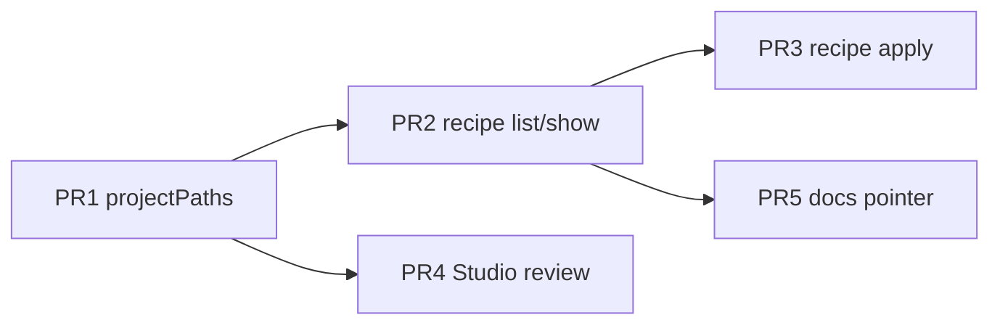

# 00 · 总览：存放契约落地

| 字段 | 值 |
| --- | --- |
| 对应设计 | [`docs/design-placement-contract.md`](../docs/design-placement-contract.md)（产品形状 P0–P14） |
| 核（已落地、不重开） | [`docs/design-study-explainer.md`](../docs/design-study-explainer.md)（D1–D13） |
| 本文件 | 整条线的程序级实施计划。单 PR 细节见 `spec/01`–`05` |
| 范围 | PR1–PR5。PR6 媒体劳动不在本目录（Q-media = M2） |

LightWeaver 已经有可跑的 study-explainer 核：`FilmDoc.task`、`TaskModule`、场景 CRUD CLI / HTTP、`isRenderable`、Studio `StudyExplainerPane`、Remotion `StudyFilm`、四则 first-party 片子。对象其实已经分家——教学意图在 LightUI `studies/<slug>/idea.md`，共享音色在 `library/`，静帧与旁白 wav 在项目 `assets/`，成片应进 `assets/outputs/`——但 agent 没有一张可发现的存放图，只能在仓里乱走或缩进 Studio CRUD，不知道何时才该 `tts` / `render`。本程序把产品面钉成固定的 **理念 / 资产 / 产物** 存放契约：agent 用 `weaver project show --json` 的 `paths` 找到三层、用 recipe 学会怎么结合、只在需要时经确定性 weaver job 写产物。核保留，当 agent 调用的 job API。Studio 降为复核面。

## 范围

本目录落地的是 **存放契约 + 发现面 + 方法资产 + 复核面**，不是第二套 CRUD，也不是出片劳动。

| 做 | 不做 |
| --- | --- |
| PR1 `projectPaths` + `project show` 的 `paths`/`renderable` + skill 约定表 | 不改 `FilmDoc`，不加 `film.recipeId` |
| PR2 仓库根 `recipes/study-explainer/` 6 张真卡 + `recipe list\|show` | 不加 `weaver produce` / `weaver plan` / `weaver paths` |
| PR3 `recipe apply`（确定性骨架，无 LLM） | 不手截 nav/sidebar png，不跑 tts/render/publish（PR6 / M2） |
| PR4 Studio 文案 + `/api/media` 播 mp4 | 不做 MCP、drama-plot、Remotion Player、核内 LLM |
| PR5 AGENTS / conventions 指针 | 不把 `idea.md` 拷进片子；不把 `projectPaths` 放进 `project.ts` |

人读顺序：本文件 → `spec/01-pr1-project-paths.md` → `02` → `03`；`04` 可与 `02` 并行（只依赖 PR1）；`05` 等 `recipes/` 目录进仓后再写。

## 现网

study-explainer 核已按 `docs/design-study-explainer.md` 落地。实施时以这些 **真实名字** 为准，不要重做。

### 核与任务

- `weaver/src/schema.ts`：`TASK_IDS = ["study-explainer"]`；`filmTask` / `filmStudySlug` / `normalizeFilm` / `parseAssetRef`（只认 `library:` / `asset:`）。
- `weaver/src/tasks/{types,registry,study-explainer}.ts`：`TaskModule`（`createFilm` + `validate` + `sceneKinds`）；`getTask` / `tryGetTask` / `listTasks` / `LIGHTUI_LAB_ADAPTERS = ["intent-cascade", "dropdown-taxonomy"]`。`createFilm` 种子是 `title` + `hero`（无 `still` 键）+ `close`。TaskModule **禁止** import `project.ts` / `validate.ts` / `assets.ts`。
- `weaver/src/scenes.ts`：`addScene` / `removeScene` / `moveScene` / `patchScene` / `setCard` / `setVoice`。`addScene` 把 `lines[locale]` 写成 **scene id 占位**（非空，`validate` Q3 会过）。

### 路径、项目、资产、校验

- `weaver/src/paths.ts`：`weaverRoot`、`libraryRoot`、`firstPartyRoot`、`userRoot`、`filmsProductRoot`、`lightuiRoot`、`labUrl`、`requireLightuiRoot`、`projectRoots`。**尚无** `recipeRoot`。
- `weaver/src/project.ts`：`listProjects` / `loadProject` / `loadProjectAt` / `saveFilm` / `saveAssets` / `createProject` / `projectSummary` / `filmPath` / `assetsPath`。`projectSummary` 只有 `id/source/root/brand/task/studySlug/locales/scenes/assets/titles`，**不加** `paths` 或 `renderable`。`project.ts` 不 import `assets.ts` / `validate.ts`（`assets.ts` 已 `import { saveAssets } from "./project.ts"`，反向会成环）。
- `weaver/src/assets.ts`：`findAsset` / `resolveAssetFile` / `lineRelPath` / `stillRelPath` / `outputRelPath` / `upsertAsset`。盘上静帧文件名以 `assets.json` `files.<locale>` 为准，**不是**从 scene id 推导。
- `weaver/src/validate.ts`：形状 error / 媒体 warning；`hasErrors`；`everyStillPngExists`；`isRenderable`（`!hasErrors(validateProject) && everyStillPngExists`）；`isCompletedFilm`（`capture.kind === "lightui-lab"` 且 png 齐）。`validate.test.ts` 已锁：intent / dropdown 可渲；nav / sidebar 形状绿、`isRenderable === false`。

### CLI（`weaver/src/cli.ts`）

现网动词：`task` / `project` / `scene` / `card` / `voice` / `asset` / `validate` / `capture` / `tts` / `render` / `publish` / `sync`。`--json` 信封。

今日 `project show`：

```ts
print({ ...projectSummary(project), film: project.film, assets: project.assets });
```

今日写操作 `envelope`：

```ts
{ ok: true, project: projectSummary(project), film, issues: validateProject(project) }
```

**没有** 同级 `paths` / `renderable` / `skipped`。**没有** `recipe` 命令。`tts`/`render` 无 id 时按 `isRenderable` skip；`tts --project` 允许缺 png；`render --project` 遇 `!isRenderable` throw。

`weaver/src/index.ts` 今日导出 schema / paths / project / assets / validate / scenes / jobs / `isRenderable` / `getTask` 等，**尚未**导出 `projectPaths` / `recipeRoot` / `listRecipes` / `applyRecipe`。

### Studio

- `products/studio/server/index.ts` `detailOf`：`{ ...projectSummary, film, assets, issues: validateProject, renderable: isRenderable }`。GET `/api/projects/:id` 已有 `renderable`，**没有** `paths`。
- `/api/media/library/*` 与 `/api/media/project/:id/*` 已存在；`products/studio/src/api.ts` `projectMedia(id, file)` → `` `/api/media/project/${id}/${file}` ``。
- `products/studio/src/App.tsx`：CRUD 齐；预览栏只有静帧 ``（`tasks/study-explainer.tsx`）；`canRender = Boolean(detail?.renderable)`；产品文案仍是「创建到 data/projects」。
- `jobs.ts` 仍只有 `tts | render`。无 capture 按钮、无「生成旁白」、无 Remotion Player。

### Skills 与片子

- `skills/lightweaver/SKILL.md`：薄路由器。
- `skills/lightweaver-film/SKILL.md` 第 8–38 行就是命令表，**没有**存放图 / 模式 / 何时停。
- `skills/lightweaver-assets/SKILL.md`：入库动词，独立（P8 保留）。
- `products/study-films/projects/` 四则：

| id | 结构 | 媒体 | `isRenderable` |
| --- | --- | --- | --- |
| `intent-cascade` | title → problem → diagonal → vertical → third → close | png + wav；`locales.zh.output = cursor-movement.mp4`；`asset:still.problem` → `assets/stills/zh/desktop-full.png` | `true` |
| `dropdown-taxonomy` | title + 7 kind + close | 同上；`source-tutorial.mp4` | `true` |
| `nav-taxonomy` | title + 9 kind（floating…shrink）+ close；`capture.kind = "manual"` | 形状绿、旁白已写、**无 png** | `false` |
| `sidebar-taxonomy` | title + 5 kind + close；manual | 同上 | `false` |

理念源仍在 LightUI：`studies/<slug>/{idea.md,idea.en.md,study.json,references/SOURCE.md}`；taxonomy 另有 `src/lib/kinds.ts`（intent-cascade **没有**）。片子只存指针 `film.study.slug`。

## 本程序交付

只交 PR1–PR5。每条可独立评审、合入后 `make typecheck && make test` 必须绿。

| PR | 标题（设计原文） | 一句话 | 单 PR spec |
| --- | --- | --- | --- |
| **PR1** | `feat(weaver): project paths contract; teach 理念/资产/产物 map` | 发现面：`projectPaths` + show/envelope 同级 `paths`/`renderable`；skill 先教约定路径与结合规则（对照 first-party `film.json` + `scene add`） | [`01-pr1-project-paths.md`](./01-pr1-project-paths.md) |
| **PR2** | `feat(weaver): discover study-explainer recipes` | 方法资产可发现：6 张真卡 + `weaver recipe list\|show`。阶段 2 仍 `scene add` | [`02-pr2-recipe-discover.md`](./02-pr2-recipe-discover.md) |
| **PR3** | `feat(weaver): apply film recipes without inventing scene kinds` | 确定性骨架：`recipe apply`。不写旁白、不猜 output、不跑 TTS/渲染 | [`03-pr3-recipe-apply.md`](./03-pr3-recipe-apply.md) |
| **PR4** | `feat(studio): review surface using projectMedia and paths.exists` | Studio 复核：文案改 agent-first；成片走 `/api/media`；CRUD 零变化 | [`04-pr4-studio-review.md`](./04-pr4-studio-review.md) |
| **PR5** | `docs: placement contract pointer; study-explainer remains the job API` | 仓内永久文档指针：核 vs 存放契约；`recipes/` 进 layout | [`05-pr5-docs.md`](./05-pr5-docs.md) |

PR1 就在 `paths.ts` 加 `recipeRoot()`（DEFAULT `join(weaverRoot(), "recipes")`，`LIGHTWEAVER_RECIPES` 仅测试），即使卡片尚未提交。PR1 的 skill / `pipeline.md` / `modes.md` **禁止**写 `recipe list` / `apply` / 链 `recipes/study-explainer/index.md`。

## PR DAG

```
PR1  projectPaths + skill 约定表
 ├── PR2  recipe list|show + 6 张真卡
 │     ├── PR3  recipe apply
 │     └── PR5  AGENTS / conventions 指针
 └── PR4  Studio 复核面（/api/media 播 mp4）
```



**为什么是这个顺序，不能倒：**

1. **PR1 解锁 PR4。** Studio `<video src={projectMedia(id, rel)}>` 需要 `paths.outputFiles[locale].rel` 与 `.exists`。没有 `projectPaths`，只能把磁盘绝对路径塞进 `src`（禁止）或另造 `outputExists`（禁止）。`detailOf` 已会算 `isRenderable`；PR4 只补 `paths`。
2. **PR2 解锁 PR3。** `applyRecipe` 读的是 `recipes/study-explainer/*.md` 的 frontmatter（`requires_kinds` / `default_scenes` / `level`）。没有卡文件和 `listRecipes` / `loadRecipe`，apply 没有输入。
3. **PR2 解锁 PR5。** PR5 要把 `recipeRoot` 与 `recipes/` 写进 `weaver/AGENTS.md` 和根 `AGENTS.md` layout。目录与函数都还不存在时写进去会变成空指针。
4. **PR1 必须先于 PR2。** `paths.recipes = join(recipeRoot(root), filmTask(film))`；`recipeRoot` 在 PR1 进 `paths.ts`。PR2 的 CLI 挂在已有 `cli.ts` 上，但发现面的 `paths.recipes` 字段属于 PR1 契约。
5. **PR3 不得与 PR2 抢 `cli.ts` 的 `recipe` 动词。** list/show 先合；apply 再加子命令与 envelope `skipped`。
6. **PR4 不依赖 recipe。** Studio v1 不调 `listRecipes`。因此 PR4 ∥ PR2 合法，只串 PR1。

合入后每条都能独立通过 `make typecheck` 与 `make test`。不要把 PR1+PR2 揉成一个「大发现 PR」——skill 正文的选卡行必须按阶段改（PR1 对照 `film.json`，PR2 才写 `recipe list`）。

`docs/conventions.md` 的存放短表：PR2 可先插一张极短表；**完整业主是 PR5**。若 PR2 已插入，PR5 **替换**成完整短表，禁止叠两张。

## 跨 PR 硬约束

下列全部继承，本程序不重开。实施任何 PR 前先对照；冲突以设计原文为准。

### 核（D1–D13 摘要，已落地）

| id | 约束 |
| --- | --- |
| **D1** | `FilmDoc.task`；今日唯一值 `study-explainer`。缺省视为该值。 |
| **D2** | 扩展点是 `TaskModule`，不是全局新 scene kind。`study-explainer.ts` 禁 import `project.ts` / `validate.ts` / `assets.ts`。读路径用 `tryGetTask`，不 throw。 |
| **D3** | 教学契约是叙事，不是死锁 4 场。禁止把多种 LightUI kind 压进一场。 |
| **D4** | 形状 error / 媒体 warning。`isRenderable` 不把缺 png 升级成 validate error。manual 片禁止调 `weaver capture`。无参 `tts`/`render` 按 `isRenderable` skip。 |
| **D5** | 日后 `drama-plot` 仍是 script-first，输入不是已有成片。现在不建空模块。 |
| **D6** | first-party 只由 CLI 创建；Studio「新建」恒 `data/projects/`。`createFilm` **不**按 slug 猜 output（intent 是 `cursor-movement.mp4`）。 |
| **D7** | 身份是 `study.slug`；`capture.kind` 是截图策略。新 manual 片不写 `capture.slug`。 |
| **D8** | 人机同一命令面。`PUT /api/projects/:id/film` 是逃生舱。 |
| **D9** | 无 MCP、无 Player、无 clip/overlay、无空 `explore/`、无 DAM、无 Vercel。 |
| **D10** | 种子带 `hero`。first-party 入库前 `scene rm --id hero`。测试只断言完成片。 |
| **D11** | `role` 可选糖。全无 role 不警告；写了一个则须 problem+contrast 或全 still=contrast。 |
| **D12** | 无 `publish.dir` 只渲到 `assets/outputs/`。`runPublish` 无 dir 明确报错。 |
| **D13** | 一种 kind 一场；`film.id === study.slug ===` 目录名；Studio 只展示纯文本 `http://127.0.0.1:5173/s/<slug>`。 |

### 产品形状（P0–P14，本程序落地）

| id | 约束 |
| --- | --- |
| **P0** | 产品一等对象是理念 / 资产 / 产物三层图。理念跟主题走（LightUI `idea.md` 或用户 `brief.md`），资产 `library/` + 项目 `assets/`，产物 `assets/lines/` 与 `assets/outputs/`。不把 `idea.md` 拷进片子，不把产物写进理念目录。 |
| **P1** | 循环仍是 agent-driven 场景编排。Studio 不是地图。 |
| **P2** | Remotion 是渲染器。继续一部任务一个 `StudyFilm.tsx`。v1 禁止为某片生成新 TSX。 |
| **P3** | Studio 是复核面。CRUD 留下。不加 Player / lab iframe / Studio 内 LLM。 |
| **P4** | Agent 面是 Skill，不是 MCP，不是「Studio 当 API」。`lightweaver` 继续薄；`lightweaver-film` 教地图；`lightweaver-assets` 独立。 |
| **P5** | Recipe 是方法资产，住仓库根 `recipes/study-explainer/`。禁止 `library/recipes/`，禁止 `skills/**/recipes/`。 |
| **P6** | LLM 只住在 agent 进程。`weaver/` 与 Studio job **不准**调模型、不准移植 NarratoAI `script_service`、不准 `weaver produce --llm`。 |
| **P7** | 最小 CLI：PR1 `paths`；PR2 `recipe list\|show`；PR3 `apply`。不加 `produce` / `plan`。 |
| **P8** | 资产 skill 不折进生产 skill。 |
| **P9** | 三种模式：`template` / `from-study` / `co-create`。未选模式 → 停。 |
| **P10** | 制作阶段 0–7。阶段 5 是 TTS（不是写 Remotion TSX）。PR 分期抄进 `pipeline.md` 时必须带上对应行。 |
| **P11** | v1 只提交 6 张从四则 study 抽出的真卡。禁止 152 空卡、禁止 `wip-*.md`。 |
| **P12** | 前一份设计全部有效。循环禁令、种子 `hero`、id=slug，全部不改。 |
| **P13** | 家族边界不松：本仓不自动剪已有成片；不调 CineWeaver `drama_clone`。 |
| **P14** | 发现面：媒体用 `MediaFile` / `MediaPath`（**必填 `rel`**），理念用 brief `PathEntry`（项目外，v1 不填 `rel`）。`stillFiles` / `lineFiles` 是数组，用 `find(f => f.locale === locale && f.sceneId === id)`。**不加** line `textHash`。v1 旁白是否过期只看「本会话是否 `scene set --text`」（agent 记账）。 |

### 结合规则（agent 何时才生成视频）

判据只认：`validate` 的 `hasErrors`、show 的 `renderable`、`paths.stillFiles[].exists`、`paths.lineFiles[].exists`、`paths.outputFiles[locale].exists`。不要另造 `outputExists`。

| 判据 | 动作 |
| --- | --- |
| `hasErrors(validate)` | **停全部生成**（含 tts / render / capture）。先修 FilmDoc |
| `!hasErrors` 且 `!isRenderable` | 允许 `tts --project`。**禁止** `render --project` |
| `capture.kind === "manual"` 且某 png 缺 | **停**。手截到 `assets.json` 已登记路径。**禁止**调 `weaver capture` |
| 某 `lineFiles.find(…).exists === false` | `tts`（可 `--scene`） |
| wav 在且本会话未对该场 `scene set --text` | **复用**，不调 tts |
| `isRenderable` 且 output 在且本会话未改旁白 / 未换 still | **不** `render` |
| `isRenderable` 且 output 缺，或本会话刚 tts / 换 png | `render --project` |
| 无 `publish.dir` | 只写 `assets/outputs/`，不要调 `publish` |
| first-party 旁白已按 idea.md 写好（现网 nav/sidebar） | **不要**重写 `lines` |

### 实现闸（所有 PR 共用）

- **不改 `FilmDoc`。** Recipe 不是片子字段。
- **`projectPaths` 不进 `project.ts`。** 新模块 `weaver/src/project-paths.ts`。可用 `lightuiRoot` / `libraryRoot` / `recipeRoot` / `labUrl` / `filmPath` / `assetsPath`，以及 `resolveAssetFile` / `lineRelPath` / `outputRelPath`。禁止扫整个仓库。`renderable` **只**在 `cli.ts` 与 Studio `detailOf` 里用 `isRenderable(project)` 计算。
- **`recipes.ts` 禁 import `validate.ts`。** 可 import `schema.ts`、`scenes.ts` 的 `addScene`/`removeScene`、`project.ts` 的 `loadProject`/`saveFilm`。
- weaver **不** import `products/*`；Studio **不** import Remotion 或 LightUI 源码。
- weaver **不** parse `idea.md` / `kinds.ts` / `brief.md`。`--kinds` 由 agent 传入。
- `listRecipes` 只扫 `recipes/<task>/*.md` 一层；**静默跳过** `index.md` 与非法 frontmatter，不要 `console.warn`。
- Studio `<video src>` **只用** `projectMedia(id, rel)`（即 `/api/media/project/:id/...`）。绝对 `path` 只作可复制纯文本。
- CLI 错误与操作者日志用中文；标识符用英文。
- 不发明仓库顶层目录（`media/`、`briefs/`、`out/`、`explore/`）。
- 不提交 `assets/outputs/`（根 `.gitignore` 已有 `**/assets/outputs/`）。
- LightUI 不在时：`lightuiRoot()` 仍拼出意图路径，`exists: false`，**不** `requireLightuiRoot` throw。

## 文件总表

### NEW（本程序创建）

| 文件 | 首个 PR | 职责 |
| --- | --- | --- |
| `weaver/src/project-paths.ts` | PR1 | 导出 `PathEntry` / `MediaPath` / `MediaFile` / `ProjectPaths` / `projectPaths(project, root)` |
| `weaver/src/project-paths.test.ts` | PR1 | intent：`brief.kind==="study"`、`kinds.exists===false`、`stillFiles` 的 problem/zh `rel === "assets/stills/zh/desktop-full.png"`；nav：still/line/output `exists` 如实 |
| `skills/lightweaver-film/references/pipeline.md` | PR1 | 阶段 0–7。PR1 行：对照 `film.json` + `scene add`。PR2 改阶段 1；PR3 改阶段 2 |
| `skills/lightweaver-film/references/modes.md` | PR1 | 停 / 跑表。PR1：「四则 film.json 对不上」。PR2 才写 `recipe list` 对不上 |
| `skills/lightweaver-film/references/qa.md` | PR1 | Q1–Q10。前 5 条只要求去读 weaver，不在 agent 里重写校验 |
| `weaver/src/recipes.ts` | PR2 | `listRecipes` / `loadRecipe`；PR3 再加 `applyRecipe` |
| `weaver/src/recipes.test.ts` | PR2 | list 跳过 `index.md`；show 返回 frontmatter+body；PR3 补 apply / skipped / 拒 scene 卡 |
| `recipes/study-explainer/index.md` | PR2 | 六行 `id — when` |
| `recipes/study-explainer/problem-then-rule.md` | PR2 | film 卡；canon=`intent-cascade`；`default_scenes` 写死 problem/diagonal/vertical/third |
| `recipes/study-explainer/taxonomy-parade.md` | PR2 | film 卡；`requires_kinds: true`；canon=dropdown/nav/sidebar |
| `recipes/study-explainer/kind-still.md` | PR2 | scene 卡；不可 apply |
| `recipes/study-explainer/contrast-pair.md` | PR2 | scene 卡；不可 apply |
| `recipes/study-explainer/study-title.md` | PR2 | scene 卡 |
| `recipes/study-explainer/say-it-this-way.md` | PR2 | scene 卡 |

`spec/01`–`05` 是本目录的实施规格，不是产品对象。

### TOUCHED（本程序改已有文件）

| 文件 | PR | 改什么 |
| --- | --- | --- |
| `weaver/src/paths.ts` | PR1 | 加 `recipeRoot()`，与 `libraryRoot` 并列 |
| `weaver/src/cli.ts` | PR1, PR2, PR3 | show / envelope 同级加 `paths`；PR1 另在 show 加 `renderable`；PR2 `recipe list\|show`；PR3 `recipe apply` + envelope `skipped` |
| `weaver/src/index.ts` | PR1, PR2, PR3 | 导出 `projectPaths`（及类型）；PR2 `listRecipes`/`loadRecipe`/`recipeRoot`；PR3 `applyRecipe` |
| `skills/lightweaver/SKILL.md` | PR1 | 路由表保证「制作一部讲解片 / 选配方 / 从 study 出片 → lightweaver-film」 |
| `skills/lightweaver-film/SKILL.md` | PR1, PR2, PR3 | PR1：存放图 + 结合规则 + 十条原则 + 对照 film.json；PR2 换选卡行；PR3 动词加 apply |
| `skills/lightweaver-assets/SKILL.md` | PR1 | 补一句：阶段 4 的 still 入库由 film skill 切到本 skill，这里不教叙事 |
| `README.md` | PR1 | 第一路径改为 agent + `project show --json`；Studio 降为复核 |
| `docs/conventions.md` | PR2, PR5 | PR2 可插极短表；**PR5 替换成完整三层表**（业主） |
| `products/studio/server/index.ts` | PR4 | `detailOf` 加 `paths: projectPaths(project, root)`（`renderable` 已在） |
| `products/studio/src/types.ts` | PR4 | `ProjectDetail` 加 `paths` |
| `products/studio/src/App.tsx` | PR4 | 文案；`outputFiles[locale].exists` 时 `<video src={projectMedia(id, rel)}>`；绝对 path 纯文本；可渲状态行 |
| `products/studio/src/tasks/study-explainer.tsx` | PR4 | 复核清单：缺 png 的 scene id。CRUD 零变化 |
| `products/studio/README.md` / `AGENTS.md` | PR4 | 复核面；`<video>` 只走 `/api/media` |
| `docs/design-study-explainer.md` | PR5 | 文首指针 + 分工表 |
| `weaver/AGENTS.md` | PR5 | 禁止 LLM；`recipeRoot` 与 `libraryRoot` 并列；`project-paths.ts` 循环禁令 |
| `AGENTS.md` | PR5 | layout 补 `recipes/` |

### 明确不改（本程序）

| 文件 | 原因 |
| --- | --- |
| `weaver/src/project.ts` | `projectPaths` 放这里会与 `assets.ts → saveAssets` 成环 |
| `weaver/src/schema.ts` / 四则 `film.json` | 不改 FilmDoc；PR3 **不**覆盖已有 first-party 旁白 |
| `weaver/src/validate.ts` / `tasks/*` / `scenes.ts` | 核已够用；apply 调现有 `addScene`/`removeScene` |
| `products/study-films/src/compositions/StudyFilm.tsx` | 一任务一份 composition |
| `products/study-films/scripts/capture.mjs` | 不写 nav adapter |
| `products/studio/server/jobs.ts` | 仍只有 `tts \| render` |
| nav/sidebar `assets/stills/**`、`assets/lines/**` | PR6 / M2 |

回滚：删 `project-paths.ts`、`recipes.ts`、`recipes/`、skill `references/`；FilmDoc / 媒体不动。

## 端到端验收

按 PR 增量；整条线合入后下列全部成立。

### PR1 后：agent 能按 JSON 判断缺什么

```bash
npx weaver project show nav-taxonomy --json
```

信封为 `{ ...projectSummary, film, assets, paths, renderable }`（`renderable === false`，不进 `projectSummary`，`project list` 保持轻）。agent **不必逛仓** 即可知道：

- `paths.brief.kind === "study"`，`brief.files.{idea,ideaEn,study,kinds,sourceMd}` 各有 `path` + `exists`（LightUI 不在则 `exists: false`，不 throw）。
- `paths.stillFiles`：9 kind × 2 locale，`rel` 来自 `assets.json`（如 `assets/stills/zh/floating.png`），现网 `exists: false`。
- `paths.lineFiles`：11 场 × 2 locale，`rel = assets/lines/<locale>/<sceneId>.wav`（与 `lineRelPath` 同形），现网 wav 不在 → `exists: false`。
- `paths.outputFiles.zh.rel === "assets/outputs/source-tutorial.mp4"`（**不是**猜的 `nav-taxonomy.mp4`），`exists: false`。
- `paths.recipes` 指向 `…/recipes/study-explainer`（目录可尚未存在）。
- 对照 `intent-cascade`：`renderable === true`；`stillFiles` 里 `sceneId=problem, locale=zh` 的 `rel === "assets/stills/zh/desktop-full.png"`，`exists: true`；`kinds.exists === false`。

写操作 `envelope` 同级也带 `paths`。SKILL 正文有存放图与结合规则；**没有** `recipe list` / `apply` 字样。

### PR2 后：能列配方

```bash
npx weaver recipe list --task study-explainer --json
npx weaver recipe show taxonomy-parade --json
```

`list` 返回 6 张卡的 id / task / level / when / canon / path，**不含** `index.md`、不含全文。`show` 含 frontmatter + `body`。SKILL 选卡行与 `pipeline.md` 阶段 1 改为 `recipe list`/`show` + `index.md`；阶段 2 仍写 `scene add`/`rm`。

### PR3 后：能在临时项目上 apply

```bash
npx weaver project create tmp-parade --task study-explainer --source user
npx weaver recipe apply --project tmp-parade --recipe taxonomy-parade \
  --kinds floating,sidebar --json
```

信封 `{ ok, project, film, issues, skipped, paths }`：种子 `hero` 已删；新增 `floating`/`sidebar` 为 `kind=still`、`still=asset:still.<id>`、`fit=contain`、`role=contrast`；`lines` 是 id 占位（须在阶段 3 `scene set` 换成真旁白）。同 id 再 apply → 进入 `skipped`，**不**覆盖旁白、不进 `Issue[]`。对现网 `nav-taxonomy` apply 不得改已写旁白。scene 卡 apply → 中文 error exit 2。`taxonomy-parade` 无 `--kinds` → 中文 error（「由 agent 从 kinds.ts 读入，不要让 weaver 解析 LightUI」）。

测完删掉 `data/projects/tmp-parade/`（gitignore 树）。

### PR4 后：Studio 经 `/api/media` 播 mp4

- GET `/api/projects/:id` 的 `detailOf` 含 `paths` + 已有的 `renderable`。
- 当 `paths.outputFiles[locale].exists`：预览 `<video src={projectMedia(detail.id, paths.outputFiles[locale].rel)}>`，即 `/api/media/project/:id/assets/outputs/<output>`。**禁止**把 `paths.outputFiles[locale].path` 塞进 `src`。
- `exists === false`：维持今日静帧 ``（`stillPreviewSrc`）。
- 复核条：`可渲 / 不可渲` + 缺 png 的 scene id。顶栏 / README / 「新建」副文案改为：片子由 agent 经 `weaver` 写；这里复核、改词、补静帧。
- CRUD、`StudyExplainerPane`、job 类型、无 Player / 无「生成旁白」，全部不变。

可用 `intent-cascade` 本机渲一版 mp4（gitignore）验证播放；nav 保持黄、仍显示静帧占位。

### PR5 后：仓内指针一致

根 `AGENTS.md` layout 有 `recipes/`；`weaver/AGENTS.md` 写明 `recipeRoot`、循环禁令、禁止 LLM；`docs/design-study-explainer.md` 文首指向存放契约。不出现 scratch 路径当永久约定。

## 明确不做

本程序 **不是** study-explainer 核的第二轮，也不是出片冲刺。下列全部排除：

| 项 | 说明 |
| --- | --- |
| **PR6 媒体劳动（Q-media = M2）** | 不为 nav/sidebar 手截 18+10 张 png，不跑 tts / render / publish。它们保持形状绿、`isRenderable === false`。手截配方已在 `docs/conventions.md`，那是独立媒体工作。 |
| **MCP** | 不发明 MCP tools。HTTP 仍是 Studio 本机 API，不是 agent 主面。 |
| **`weaver produce` / `weaver plan` / `weaver paths`** | 听起来像核内编剧或一键出片。发现挂在已有 `project show`。 |
| **drama-plot** | 不建空 task、空 composition、空 `recipes/drama-plot/`。日后走同一张三层图，另开设计。 |
| **CineWeaver** | 不摄入已有成片、不 ASR、不自动切、不调 `drama_clone` / Streamlit。`AGENTS.md` 家族边界不松。 |
| **Vercel / 非 127.0.0.1** | Studio / lab / API 继续绑本机。 |
| **FilmDoc 迁移** | 不加 `film.recipeId`、不加 line `textHash`、不改四则已提交 `film.json` 结构。 |
| **核内 / Studio LLM** | 无 `/api/generate`、无「一键写旁白」、不移植 NarratoAI `generate_narration_script` / `script_service`。 |
| **Remotion 逐片 TSX** | 不跑 `/remotion-create`。`StudyFilm.tsx` 仍是唯一 composition。 |
| **152 空卡 / shotcraft 进口** | 只 6 张有 canon 的真卡。无 Ink Press、无 2.5D、无 SFX。 |
| **DAM / LightTTS 训练面** | `library/` 不加子目录。本仓只调现有 `scripts/tts.py`。 |
| **往 LightUI 公开 README / lab 写兄弟仓名** | publish 仍只拷 mp4。 |

## 开工顺序

1. **先跑绿，再看今日信封。** 实施者第一条命令：

   ```bash
   make typecheck && make test && npx weaver project show nav-taxonomy --json
   ```

   今日输出是 `{ ...projectSummary, film, assets }`，**没有** `paths` / `renderable`。把这份 JSON 当作 PR1 的 before 夹具。顺手对照 `intent-cascade`（可渲）与 `validate.test.ts` 里 nav/sidebar `isRenderable === false`。

2. **只开 PR1。** 按 [`01-pr1-project-paths.md`](./01-pr1-project-paths.md)：新建 `weaver/src/project-paths.ts`（不要碰 `project.ts`），`paths.ts` 加 `recipeRoot`，`cli.ts` 的 `project show` 与 `envelope` 同级挂 `paths`，show 另挂 `renderable: isRenderable(project)`，`index.ts` 导出 `projectPaths`。Skill 写约定路径 + 结合规则 + PR1 行的 `pipeline.md`/`modes.md`/`qa.md`。**不要**创建 `recipes/*.md`，不要在 SKILL 里写 `recipe list`。

3. **PR1 合入后再分叉：**
   - PR2（[`02`](./02-pr2-recipe-discover.md)）→ 然后 PR3（[`03`](./03-pr3-recipe-apply.md)）与 PR5（[`05`](./05-pr5-docs.md)）。
   - PR4（[`04`](./04-pr4-studio-review.md)）可与 PR2 并行，只依赖 `projectPaths`。

4. **每条 PR 合入门槛：** `make typecheck && make test`。PR1 额外用 show JSON 人工对一遍 nav 的 `stillFiles`/`lineFiles`/`outputFiles`/`brief`。PR3 只在 `data/projects/` 临时项目上 apply，测完删掉。不要对四则 first-party 跑 apply 当「整理」。

5. **不要提前做的：** 手截 png、改 `StudyFilm.tsx`、加 MCP、在 Studio 加生成按钮、把本文件与 `01`–`05` 揉进一次提交。

本文件是地图。改核先改 `docs/design-study-explainer.md`；改制作方法先改 `docs/design-placement-contract.md`，再改对应 `spec/0N`。两份设计不要合并。
